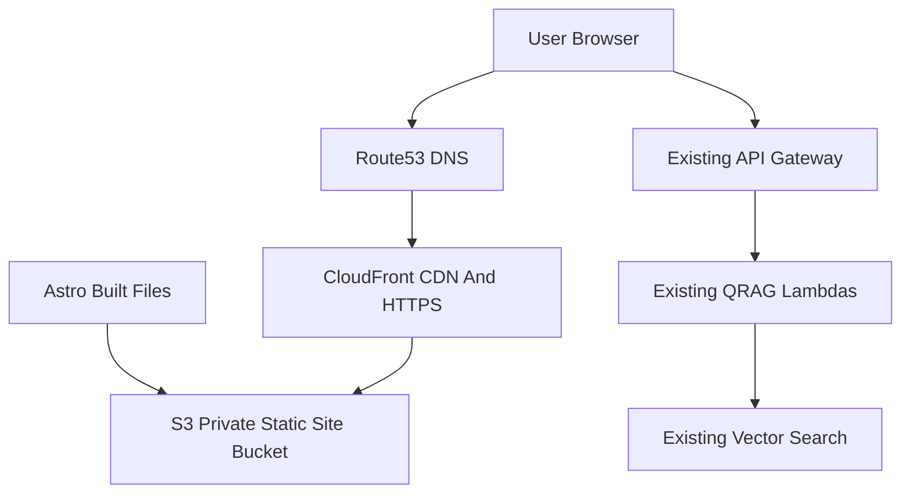

# AWS Astro Site Migration Plan

## Goal
Move `focusonfoundations.org` from Webflow to a repo-owned Astro frontend hosted on AWS S3 + CloudFront. The current QRAG demos should keep using the existing AWS API Gateway/Lambda backends, while the public homepage becomes a new static landing page and the current QRAG demo hub moves under a demos route.

This plan is written to be self-contained for a new worktree/session.

## Current Context To Preserve
- Current public site: `https://focusonfoundations.org` shows a simple Focus on Foundations landing/demo page: heading “Deep Optimism”, copy about AI Q&A demos, privacy/terms consent, and demo links for Deutsch Interviews, FDA COVID-19 Tests, PV School Evacuation, and Sovereign Child.
- Current Webflow frontend source of truth is mostly in:
  - [`web-shared/webflow/webflow-fof-site-head.html`](web-shared/webflow/webflow-fof-site-head.html): CSS, validator CDN, Webflow/Sygnal membership setup.
  - [`web-shared/webflow/webflow-fof-site-body.js`](web-shared/webflow/webflow-fof-site-body.js): shared QRAG UI helpers, privacy consent, email/hash-store, validation, demo configuration.
  - [`web-shared/webflow/webflow-fof-home-body.html`](web-shared/webflow/webflow-fof-home-body.html): home-page session/user handling and HMAC hash endpoint.
  - [`apps/qrag/web/webflow-rag-devpage.js`](apps/qrag/web/webflow-rag-devpage.js): QRAG/VRAG demo interaction, API calls, rendering, retry/error behavior.
  - [`apps/qrag/web/webflow-qrag-input-component-date-embed.html`](apps/qrag/web/webflow-qrag-input-component-date-embed.html): reusable QRAG input form and date-range behavior.
- Current legal text should be reused from:
  - [`web-shared/web_docs/2024-12-17_terms-of-service.md`](web-shared/web_docs/2024-12-17_terms-of-service.md)
  - [`web-shared/web_docs/2024-12-17_privacy-policy.md`](web-shared/web_docs/2024-12-17_privacy-policy.md)
- Current important frontend API endpoints found in code:
  - HMAC hash: `https://[API-GATEWAY-ID].execute-api.us-west-2.amazonaws.com/api/generate-hash`
  - Send email: `https://[API-GATEWAY-ID].execute-api.us-west-2.amazonaws.com/prod/send-email`
  - Hash store: `https://[API-GATEWAY-ID].execute-api.us-west-2.amazonaws.com/prod/hash-store`
  - QRAG routing prod: `https://[API-GATEWAY-ID].execute-api.us-west-2.amazonaws.com/prod/qrag-routing`
  - QRAG LLM prod: `https://[API-GATEWAY-ID].execute-api.us-west-2.amazonaws.com/prod/qrag-llm`
  - VRAG LLM prod: `https://[API-GATEWAY-ID].execute-api.us-west-2.amazonaws.com/prod/vrag-llm`
- Current demo configuration in [`web-shared/webflow/webflow-fof-site-body.js`](web-shared/webflow/webflow-fof-site-body.js) maps demo buttons to vector indexes and route dicts. Preserve those values unless explicitly updating demos.
- Current frontend has Webflow-specific assumptions to remove or replace:
  - `window.Webflow.push(...)`
  - Webflow CSS classes such as `w-button`, `w-container`, and Webflow layout wrappers.
  - Sygnal SA5 membership scripts and `window.sa5` hooks. Auth is mostly disabled/legacy; do not rebuild formal auth in phase 1 unless separately requested.
- Tooling check from this session:
  - `node` exists at `/usr/local/bin/node`, version `v20.12.1`.
  - `npm` exists at `/usr/local/bin/npm`, version `10.5.0`.
  - `aws` was not found in PATH.
  - `chalice` was not found in PATH.
  - Treat AWS CLI installation/configuration as a setup task before infrastructure work.

## Target Architecture
Use static frontend hosting, not EC2 and not a container, for the public website. EC2 can remain separate for future Minecraft hosting; do not colocate a compute-heavy Minecraft server and the public website.



Recommended AWS frontend services:
- S3 private buckets hold built static files for staging and production.
- CloudFront distributions serve the site over HTTPS and cache static assets.
- ACM certificates provide TLS. For CloudFront, certificates must be in `us-east-1`.
- Route 53 manages DNS for `focusonfoundations.org`, `www.focusonfoundations.org`, and `staging.focusonfoundations.org` if DNS is moved to AWS.
- API Gateway/Lambda QRAG services remain unchanged except for CORS origin updates.

Recommended frontend framework:
- Astro static site, built locally and previewed locally before each deploy.
- Use vanilla JS modules initially for the QRAG port unless a clear component need emerges. Avoid a React migration during phase 1 unless the design or interaction complexity demands it.

## Repo Layout
Create the new site under an app-specific folder, keeping it portable outside AWS:

```text
apps/focusonfoundations/
  web/
    package.json
    astro.config.mjs
    src/
      pages/
        index.astro
        demos/index.astro
        demos/deutsch.astro
        demos/fda-town-halls.astro
        demos/pv-evacuation.astro
        demos/sovereign-child.astro
        terms.astro
        privacy.astro
      components/
        SiteLayout.astro
        Header.astro
        Footer.astro
        QragDemo.astro
        QragInput.astro
        PrivacyConsent.astro
      lib/
        api-endpoints.js
        demo-config.js
        qrag-client.js
        qrag-ui.js
        validation.js
        privacy-consent.js
        share-email.js
      styles/
        global.css
    public/
      assets/
  infra/
    package.json
    bin/
      fof-site.ts
    lib/
      static-site-stack.ts
    cdk.json
  README.md
```

Notes:
- Keep the Astro site portable. The `web/` app should know only about public endpoint environment variables and should not import AWS CDK code.
- Keep AWS infrastructure in `infra/`, separate from the static site.
- If the repo later standardizes JavaScript workspaces, this layout can be adapted, but do not block the migration on monorepo packaging.

## Phase 1: Pre-Cutover AWS Setup
This phase creates staging and production hosting infrastructure before moving DNS for the live domain.

### 1. Session And Worktree Setup
- Start in the intended worktree and confirm branch/worktree state before edits.
- Follow repo branch discipline: do not create/switch branches without explicit confirmation in the new session.
- Because the user plans to use a separate worktree, document the worktree path and branch in the implementation notes or PR description.

### 2. Install And Verify Local Tooling
- Verify Node/npm again:
  - `node --version`
  - `npm --version`
- Install AWS CLI v2 if `aws --version` still fails.
- Configure credentials/profile if needed:
  - `aws sts get-caller-identity`
  - Confirm expected AWS account and region before creating resources.
- Decide the default AWS region for this site infrastructure. Recommended: use `us-east-1` for the static-site CDK stacks to avoid CloudFront certificate region complexity. Existing QRAG Lambdas can stay in `us-west-2`.
- Chalice is not required for static site infrastructure unless backend CORS changes are deployed through existing Chalice apps.

### 3. Choose Infrastructure Method
Use AWS CDK for repeatable infrastructure, plus AWS CLI for content deploys.

Recommended division:
- CDK creates stable infrastructure: buckets, CloudFront distributions, ACM certificates, Route 53 records, cache behavior, security policies.
- Local scripts deploy content after local inspection: `npm run build`, `npm run preview`, then `aws s3 sync` and CloudFront invalidation.

Reasoning:
- This keeps infrastructure as code.
- It still satisfies the requirement to build and inspect locally before anything goes live.
- A CDK deploy should not automatically publish a new site build.

### 4. Create Staging And Production Infra Stacks
Create two environments:
- Staging: `staging.focusonfoundations.org`
- Production: `focusonfoundations.org` and `www.focusonfoundations.org`

Each environment should include:
- Private S3 bucket with block public access enabled.
- CloudFront distribution using Origin Access Control (OAC), not public S3 website hosting.
- CloudFront default root object `index.html`.
- CloudFront Function or equivalent rewrite so extensionless Astro routes resolve cleanly:
  - `/privacy` -> `/privacy/index.html`
  - `/demos` -> `/demos/index.html`
  - paths with file extensions pass through unchanged.
- Error responses configured to serve a friendly static `404.html` where appropriate.
- ACM certificate for the relevant domain names.
- Route 53 records if the hosted zone is in AWS.

### 5. Route 53 And Domain Transfer Decision
Decide whether to move DNS hosting to Route 53 or leave DNS at the current registrar/provider.

Recommended path:
- Create/import a Route 53 hosted zone for `focusonfoundations.org`.
- Add required records there.
- At the registrar, update nameservers to Route 53 when ready.

Pre-cutover checklist:
- Identify the current registrar and current DNS records.
- Export/screenshot current DNS records before changing anything.
- Recreate non-website records in Route 53, especially email-related records if any exist:
  - MX
  - SPF/TXT
  - DKIM/TXT
  - DMARC/TXT
  - any verification records
- Do not update nameservers until staging is working and production CloudFront is ready.

### 6. Backend CORS Preparation
The static site will call existing API Gateway endpoints from new origins.

Required origins to allow:
- `http://localhost:4321` for Astro local dev.
- The Astro local preview origin, likely `http://localhost:4321` unless changed.
- `https://staging.focusonfoundations.org`
- `https://focusonfoundations.org`
- `https://www.focusonfoundations.org`

Update CORS on the existing API Gateway/Chalice backends only if requests fail from the new origins. Keep the backend behavior unchanged.

Relevant backend app folders include:
- [`apps/qrag/api/qrag-routing`](apps/qrag/api/qrag-routing)
- [`apps/qrag/api/qrag-llm`](apps/qrag/api/qrag-llm)
- [`apps/qrag/api/vrag-llm`](apps/qrag/api/vrag-llm)
- Existing shared API Gateway endpoints for hash/email under the current repo structure.

## Phase 2: Astro Website Build And Local Review
This phase is independent of AWS hosting. The site should be fully usable locally before deploying to staging.

### 1. Scaffold Astro App
- Create `apps/focusonfoundations/web/` with Astro.
- Use static output. No SSR adapter for phase 1.
- Add scripts:
  - `npm run dev` for local development.
  - `npm run build` for static build.
  - `npm run preview` for local preview of the built output.
  - `npm run check` if Astro/TypeScript checks are configured.
- Keep deployment scripts separate from dev/build scripts.

### 2. Recreate Site Routes
Build the new route structure:
- `/`: new static Focus on Foundations landing page.
- `/demos/`: current QRAG demo hub moved out of the homepage.
- `/demos/deutsch/`: Deutsch Interviews demo.
- `/demos/fda-town-halls/`: FDA COVID-19 Town Halls demo.
- `/demos/pv-evacuation/`: PV School Evacuation demo.
- `/demos/sovereign-child/`: Sovereign Child demo.
- `/terms/`: terms page from `web-shared/web_docs/2024-12-17_terms-of-service.md`.
- `/privacy/`: privacy page from `web-shared/web_docs/2024-12-17_privacy-policy.md`.

Also preserve or redirect legacy Webflow URLs that are known to be shared externally, such as `fda-town-halls-qrag-demo` if still used. Add a route alias or redirect strategy rather than breaking old links.

### 3. Landing Page Content Direction
Create a simple static landing page first, before deeper design polish.

Suggested content blocks:
- Hero: Focus on Foundations and a short “Deep Optimism” positioning statement.
- Short explanation of AI Q&A demo projects.
- Link/card section for the demo hub.
- Sections for education, public safety, government, pandemic response, and future serious contexts of use.
- Footer with terms, privacy, contact.

Design can be refined later with AI/design tooling. The first milestone is structurally correct, readable, responsive, and not Webflow-dependent.

### 4. Port The QRAG UI Conservatively
Start by preserving current behavior, then clean up.

Port from:
- [`web-shared/webflow/webflow-fof-site-body.js`](web-shared/webflow/webflow-fof-site-body.js)
- [`apps/qrag/web/webflow-rag-devpage.js`](apps/qrag/web/webflow-rag-devpage.js)
- [`apps/qrag/web/webflow-qrag-input-component-date-embed.html`](apps/qrag/web/webflow-qrag-input-component-date-embed.html)

Target modules:
- `src/lib/demo-config.js`: demo metadata, vector index names, route dict names, large context filenames, date ranges.
- `src/lib/api-endpoints.js`: endpoint URLs from environment variables.
- `src/lib/qrag-client.js`: fetch calls to qrag-routing, qrag-llm, vrag-llm.
- `src/lib/qrag-ui.js`: DOM/UI rendering, accordion/result display, loading/error states.
- `src/lib/validation.js`: replace CDN `validator` use with npm `validator` or simpler local validation if sufficient.
- `src/lib/privacy-consent.js`: preserve consent gating/sessionStorage behavior.
- `src/lib/share-email.js`: preserve email/share/hash-store behavior.
- `src/components/QragDemo.astro` and `src/components/QragInput.astro`: reusable UI wrappers.

Do not rewrite backend request/response contracts during this phase.

### 5. Remove Webflow/Sygnal Dependencies
- Remove `window.Webflow.push(...)`; replace with ordinary `DOMContentLoaded` or Astro module initialization.
- Remove Sygnal SA5 scripts and `window.sa5` membership hooks for phase 1.
- Preserve current sessionStorage keys only if still needed by the QRAG flow.
- Replace Webflow utility classes with local CSS.
- Replace Webflow-specific layout wrappers with semantic HTML.

### 6. Environment Configuration
Use public environment variables for API URLs rather than hardcoding endpoints inside modules.

Example variable names:
- `PUBLIC_HMAC_HASH_API_URL`
- `PUBLIC_SEND_EMAIL_API_URL`
- `PUBLIC_HASH_STORE_API_URL`
- `PUBLIC_QRAG_ROUTING_API_URL`
- `PUBLIC_QRAG_LLM_API_URL`
- `PUBLIC_VRAG_LLM_API_URL`

Create:
- `.env.example` with non-secret public endpoints or placeholder values.
- `.env.local` for local development if needed, but do not commit secrets.

These endpoint URLs are public client-side URLs, not secrets. Still keep the pattern clean because future values may differ across staging/prod.

### 7. Local Review Workflow
Local review is mandatory before staging deploy.

Recommended workflow:
- `cd apps/focusonfoundations/web`
- `npm install`
- `npm run dev`
- Review local dev site.
- `npm run build`
- `npm run preview`
- Review the built static output, not only dev server output.

Manual local test checklist:
- New homepage renders and is responsive.
- `/demos/` explains and links to all demos.
- Each demo route renders the QRAG input UI.
- Privacy consent blocks demo use until accepted.
- Question submission works against existing API Gateway endpoints.
- Date ranges are configured per demo.
- Error/loading states are readable.
- Email/share flow still works or is explicitly deferred.
- Terms/privacy pages render from current markdown text.
- Browser console has no Webflow/Sygnal missing-object errors.

### 8. Testing
Add lightweight tests where they give leverage.

Recommended tests:
- Unit tests for `demo-config.js`: expected demo IDs, vector index names, date ranges, endpoint mapping.
- Unit tests for validation helpers.
- Unit tests for URL/rewrite-sensitive route helper logic if any exists.
- Optional Playwright smoke tests for static routes and consent gating if time allows.

Keep tests focused; this migration’s largest risk is broken client behavior, not deep algorithmic logic.

## Phase 3: Staging Deploy, Validation, And Production Cutover
This phase publishes the locally reviewed build to AWS staging, then production.

### 1. Staging Deploy Workflow
After local preview passes:
- Build static files locally.
- Sync built files to the staging S3 bucket.
- Invalidate the staging CloudFront distribution.
- Review `https://staging.focusonfoundations.org` in a browser.

Recommended script shape:
- `npm run deploy:staging` should run only after a successful local build.
- The deploy script should print the target bucket/distribution before syncing.
- Use conservative cache headers:
  - HTML: short/no cache.
  - hashed JS/CSS/assets: long cache.
- Invalidate at least `/*` for early phase simplicity. Optimize later if needed.

Staging validation checklist:
- SSL certificate is valid.
- All intended routes work with direct browser refresh.
- API calls work from staging origin or CORS errors are fixed.
- Mobile layout works.
- Terms/privacy links work.
- Existing Webflow live site remains untouched.

### 2. Production Infrastructure Readiness
Before cutover:
- Production CloudFront distribution exists and serves the production S3 bucket.
- Production certificate covers `focusonfoundations.org` and `www.focusonfoundations.org`.
- Production build has been deployed to the production S3 bucket.
- Production CloudFront domain can be tested directly if possible before DNS cutover.
- Route 53 records are ready but nameserver/domain cutover has not happened unless explicitly approved.
- All important DNS records from the old provider have been recreated if moving DNS hosting.

### 3. Cutover Strategy
Downtime of hours or days is acceptable, but still use a controlled cutover.

Recommended sequence:
- Lower DNS TTL at the current DNS provider ahead of cutover if possible.
- Keep Webflow active during first production cutover window for rollback.
- Confirm production deploy is current.
- Update DNS:
  - If moving DNS hosting, update registrar nameservers to Route 53.
  - If keeping DNS elsewhere, update apex/`www` records to point at CloudFront as supported by the provider.
- Verify:
  - `https://focusonfoundations.org`
  - `https://www.focusonfoundations.org`
  - redirects/canonical behavior
  - demo API calls
  - direct route refreshes
- Monitor CloudFront and browser errors.

Rollback option:
- If Webflow DNS is still intact and Webflow subscription/site remains live, point DNS back to Webflow.
- If only content is broken but DNS/CloudFront are fine, redeploy last known good S3 build and invalidate CloudFront.

### 4. Post-Cutover Cleanup
After the new site is stable:
- Keep Webflow available briefly as rollback, then cancel/decommission when confident.
- Archive or mark `web-shared/webflow/` as legacy reference.
- Update repo docs with the new local dev, staging deploy, and production deploy workflow.
- Record AWS resource names and CloudFront distribution IDs in `apps/focusonfoundations/README.md` or a runbook.
- Decide whether to preserve any Webflow CMS content or retire Webflow-specific tooling such as `core/webflow_api.py` separately.

## Implementation Milestones
### Milestone 1: Infrastructure Skeleton
Outcome: AWS CLI verified/installed, CDK infra app created, staging/prod stacks defined but not yet cut over.

Acceptance checks:
- `aws sts get-caller-identity` returns expected account.
- CDK synth succeeds.
- Staging bucket/distribution/cert/DNS can be created.
- Production resources can be created without pointing live DNS yet.

### Milestone 2: Astro Skeleton And Static Pages
Outcome: Astro app runs locally with homepage, demo hub placeholder, terms, privacy, layout, CSS.

Acceptance checks:
- `npm run dev` works.
- `npm run build` works.
- `npm run preview` works.
- Terms/privacy content renders.

### Milestone 3: QRAG Demo Port
Outcome: Existing QRAG demos work locally from Astro against existing prod API endpoints.

Acceptance checks:
- All four demos render.
- Demo config matches current Webflow values.
- Consent gating works.
- QRAG routing/LLM calls work.
- Console has no missing Webflow/Sygnal dependencies.

### Milestone 4: Staging Deploy
Outcome: Staging site works at `https://staging.focusonfoundations.org`.

Acceptance checks:
- CloudFront + SSL valid.
- Routes refresh correctly.
- API calls pass CORS.
- Manual staging checklist passes.

### Milestone 5: Production Cutover
Outcome: `focusonfoundations.org` and `www.focusonfoundations.org` serve the new Astro site through CloudFront.

Acceptance checks:
- DNS resolves to new CloudFront distribution.
- HTTPS works.
- Homepage and demos work.
- Legacy important URLs redirect or resolve.
- Webflow can be retained temporarily as rollback.

## AI-Coding Notes For The New Session
- Treat this as a migration, not a redesign-first rewrite. Preserve QRAG behavior before improving the UI.
- Keep the first Astro version boring and inspectable: static pages, local CSS, vanilla JS modules, no SSR.
- Avoid pulling EC2, Docker, App Runner, or Amplify into the website path. They solve different problems.
- Do not colocate this site with a future Minecraft EC2 instance. The site should be static S3/CloudFront; Minecraft can be separate EC2 if needed.
- The user is voice-driving AI coding and is new to Astro/CDK, so add explanatory README/runbook notes as part of implementation.
- If making infrastructure changes, print exact AWS account/region before deployment and pause for confirmation before DNS cutover.
- Do not deploy to production until the built site has been reviewed locally and on staging.
- Do not commit secrets, `.env.local`, AWS credentials, or generated build output unless a specific generated artifact is intentionally tracked.

## Open Decisions To Confirm During Implementation
- Exact new app directory name: recommended `apps/focusonfoundations/`.
- Whether to create one combined CDK stack per environment or split certificate/DNS/static site stacks. Recommended: keep simple with one static-site stack per environment in `us-east-1` if feasible.
- Whether to move DNS hosting fully to Route 53 or leave it at the current registrar/provider and only point records at CloudFront.
- Which legacy Webflow URLs must be preserved with redirects or aliases.
- Whether email/share flow is required for phase 1 parity or can be deferred if QRAG Q&A is working.

## Done Definition
The migration is complete when:
- The Astro site is the source of truth for the public website.
- The site can be built and reviewed locally before deployment.
- Staging is available and documented.
- Production is served from CloudFront/S3 with HTTPS.
- Existing QRAG Lambdas continue to serve the demos.
- The new homepage is live and the old QRAG homepage lives under a demos route.
- Webflow is no longer required for ongoing site edits.


## Plan Provenance
**Chat ID:** `db699808-24c1-4445-93fe-d7d410186398`
**Request ID:** `a75a8329`

This plan was generated at the end of the Cursor chat thread [FOF website Webflow → AWS/Astro plan](db699808-24c1-4445-93fe-d7d410186398) (June 26, 2026), in the `fof-mono` worktree session where the full AWS + Astro migration plan was requested and written.