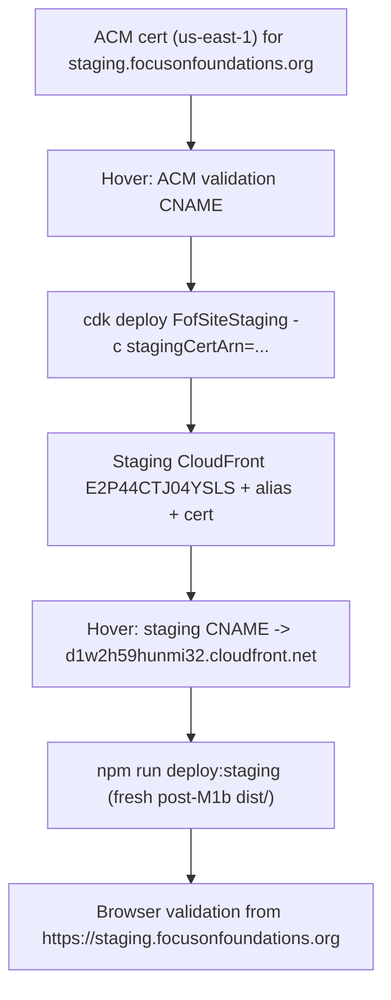

# Milestone M2 — Staging Deploy and Remote Validation

## Context (verified live, 2026-07-02)
Infra from M1 already exists; M2 finishes the "real staging hostname + fresh content + remote validation" that M1's todos claimed but did not actually complete.

- CDK stacks `FofSiteStaging` / `FofSiteProduction` are deployed. Staging distribution `E2P44CTJ04YSLS` (`d1w2h59hunmi32.cloudfront.net`) already returns HTTP 200 with the correct homepage, so site mechanics (OAC, URL-rewrite function, error pages) are proven.
- Staging bucket `fofsitestaging-sitebucket397a1860-itzdhz8si8wd` has content dated 2026-06-26 — this is STALE (pre-M1b), so the deployed demo pages still carry the broken `define:vars` init script. M2 must redeploy the current `dist/`.
- No custom domains: neither distribution has aliases; there are zero ACM certs in us-east-1. `staging.focusonfoundations.org` does not resolve today.
- DNS is at Hover (`ns1/ns2.hover.com`); there is no Route 53 hosted zone. Apex points at Webflow (`198.202.211.1`). Route 53 migration is deferred to M3.
- CORS: M1b allow-listed `https://staging.focusonfoundations.org` (not the `cloudfront.net` URL), so remote QRAG validation requires the custom staging domain. No Lambda redeploy is needed for M2.

Account `[AWS-ACCOUNT-ID]`, region `us-east-1` for all site infra.

## Approach


Manage the staging domain via CDK (attach a cert ARN + alias) instead of a manual `update-distribution`, so a later `cdk deploy` cannot silently strip the alias.

## Step 1 — Preflight and verify state
- Confirm branch `feature/web-site-redo-fof` and clean tree; confirm `aws sts get-caller-identity` is account `[AWS-ACCOUNT-ID]`.
- Regenerate the gitignored deploy config: `node scripts/save-deploy-config.js staging` in [apps/focusonfoundations/web](apps/focusonfoundations/web) (writes `deploy-config.json` from the CloudFormation exports).
- No commit here.

## Step 2 — Extend CDK for external-DNS custom domain (commit)
In [apps/focusonfoundations/infra/lib/static-site-stack.ts](apps/focusonfoundations/infra/lib/static-site-stack.ts), add an external-DNS mode that attaches an imported cert + alias without touching Route 53. Current gate:

```ts
const useCustomDomain = Boolean(props.hostedZoneId && props.hostedZoneName && props.createDnsRecords !== false);
```

Add: if `props.certificateArn` is set, import it via `acm.Certificate.fromCertificateArn`, set `distribution.domainNames = props.domainNames`, and skip all Route 53 record creation. Wire a `stagingCertArn` context value through [apps/focusonfoundations/infra/bin/fof-site.ts](apps/focusonfoundations/infra/bin/fof-site.ts) into `FofSiteStaging` only. This is additive; the existing Route 53 path (for a future M3) is unchanged.
Commit: `Add external-DNS custom-domain (cert ARN) mode to static site stack.`

## Step 3 — Request and validate the ACM cert (STOP: manual Hover step)
- `aws acm request-certificate --domain-name staging.focusonfoundations.org --validation-method DNS --region us-east-1`.
- `aws acm describe-certificate ... --region us-east-1` to read the `ResourceRecord` (validation CNAME name + value).
- STOP: Randy adds that CNAME at Hover. Then poll until `Status = ISSUED`.

## Step 4 — Attach the domain via CDK
- `cd apps/focusonfoundations/infra && npm run build && npx cdk deploy FofSiteStaging -c stagingCertArn=<arn> --require-approval never`.
- Verify with `aws cloudfront get-distribution --id E2P44CTJ04YSLS` that `Aliases` now contains `staging.focusonfoundations.org` and the ACM cert is attached.

## Step 5 — Point the staging hostname at CloudFront (STOP: manual Hover step)
- STOP: Randy adds a Hover CNAME `staging` -> `d1w2h59hunmi32.cloudfront.net`.
- Verify: `dig +short staging.focusonfoundations.org` resolves, and `curl -sI https://staging.focusonfoundations.org/` returns 200 with a valid cert (no TLS/SNI error).

## Step 6 — Deploy current post-M1b content
- `cd apps/focusonfoundations/web && npm run deploy:staging` (rebuilds `dist/`, two-pass `aws s3 sync` with split cache headers, invalidates `/*` on `E2P44CTJ04YSLS`) per [scripts/deploy.js](apps/focusonfoundations/web/scripts/deploy.js).
- Note: `deploy.js` does not pass `--region`; if the default CLI region is not us-east-1, prefix with `AWS_REGION=us-east-1` (S3 sync + CloudFront are fine, but this avoids surprises).
- Confirm the deployed demo page now has the M1b module-script fix (no stale `define:vars`).

## Step 7 — STOP: full remote validation from staging
Randy validates `https://staging.focusonfoundations.org`:
- Cert valid; homepage, `/demos/`, all four demo routes, `/terms/`, `/privacy/` resolve on direct refresh.
- Full QRAG flow (consent -> name -> question -> excerpts + AI answer) works from the staging origin (CORS already allows it).
- Legacy redirect `/fda-town-halls-qrag-demo/` resolves.
- Mobile layout OK; console clean (only intentional `console.error` on failures).
- Live `https://www.focusonfoundations.org` (Webflow) is unaffected.

## Step 8 — Tests and docs (commit)
- Add a CDK assertion test (synth `FofSiteStaging` with `stagingCertArn` context; assert the distribution has the `staging.` alias + a viewer certificate and creates no Route 53 records). Keep the 5 existing web tests green.
- Update [apps/focusonfoundations/README.md](apps/focusonfoundations/README.md) with the staging cert ARN, the `stagingCertArn` deploy command, and the Hover CNAME facts.
- Optional (M3 readiness): also run `deploy:production` content sync so the prod bucket holds the current build before M3 cutover — no DNS change.
- Commit: `Add M2 staging CDK test and document staging domain setup.`

## Acceptance
- `https://staging.focusonfoundations.org` serves the current post-M1b build over valid HTTPS.
- All routes refresh cleanly; full QRAG works from the staging origin.
- Live Webflow site and apex DNS unchanged; no Lambda redeploy performed.
- CDK owns the staging alias/cert (no manual distribution drift); tests pass.

## M2 Execution Results (2026-07-03)
All eight todos completed. **`https://staging.focusonfoundations.org` is live and fully validated.** Executed in Cursor thread [M2 build + Hover DNS troubleshooting](2dc9e7c3-8117-4f52-aa4c-25945edb646a).

Automated verification:
- TLS: valid Amazon cert, `CN=staging.focusonfoundations.org`, expires 2027-01-16, auto-renews via the retained ACM validation CNAME.
- All 9 routes HTTP 200 (homepage, demo hub, 4 demos, terms, privacy, legacy `/fda-town-halls-qrag-demo/`); nonexistent path correctly 404s.
- Staging serves the current post-M1b build (`data-demo-slug` module script present); the stale 2026-06-26 bucket content was replaced.
- CloudFront `E2P44CTJ04YSLS`: alias + cert attached via CDK (`Status: Deployed`, `sni-only`).
- Infra CDK assertion tests 2/2 pass; web unit tests 5/5 pass.
- Live `https://www.focusonfoundations.org` (Webflow) unaffected throughout.

Randy's manual browser validation (all passed):
- Full QRAG flow on `/demos/deutsch/` from the staging origin: consent → name → question → excerpts + AI answer. First real exercise of the M1b staging CORS allow-list — worked.
- Console clean on load; mobile layout OK; live www Q&A regression check passed.

Commits (pushed to `feature/web-site-redo-fof`): `ec0e8d9` CDK external-cert mode, `2cb3332` CDK test + README staging runbook, `0fb6eec` Hover trailing-dot gotcha doc.

### Issue encountered and resolved: Hover trailing-dot SERVFAIL
Step A stalled for ~90 minutes because the ACM validation CNAME target was entered with ACM's trailing dot (`...acm-validations.aws.`). Hover's UI accepted and displayed the record, but its nameservers returned **SERVFAIL** for that exact name (sibling made-up names returned NXDOMAIN — the tell that the record existed but was malformed in their backend). DNSSEC was ruled out (no DS record). Removing the trailing dot from the target fixed it; ACM issued within ~4 minutes. Gotcha is documented in [apps/focusonfoundations/README.md](apps/focusonfoundations/README.md). Diagnostic recipe for next time: `dig <name> @ns1.hover.com +noall +comments` — `SERVFAIL` = malformed record on Hover's side; `NXDOMAIN` = record not present/published.

### Carry-forwards for M3
- Hover cannot CNAME the apex (`@`), so `focusonfoundations.org` needs either Hover's A-record workaround pointing at CloudFront IPs (fragile) or the Route 53 migration — this is the central M3 decision.
- The CDK `certificateArn` external-cert mode is proven end-to-end and can be reused for the production cert (`focusonfoundations.org` + `www.`) on `E1ZC4ZN75O9QM4` if DNS stays at Hover.
- Production bucket still holds the stale 2026-06-26 build; refresh with `npm run deploy:production` during M3 (no DNS impact).
- Remember the trailing-dot gotcha for every DNS record entered at Hover.


## Next Milestone Planning (M3 and beyond)
- M3 — Production cutover: decide Route 53 vs staying at Hover; if Route 53, recreate ALL records (MX/SPF/DKIM/DMARC/verifications) before switching nameservers. Add prod cert for `focusonfoundations.org` + `www.`, attach to `E1ZC4ZN75O9QM4`, deploy current content, lower TTL, cut apex/`www` to CloudFront, keep Webflow as rollback.
- M4 — Cleanup and UX polish: resolve M1b UX-parity items (name-submit feedback, interim AI-wait message, accordion arrow, AI-answer styling), landing-page design pass, archive `web-shared/webflow/`, decide fate of `core/webflow_api.py`, finalize dev/deploy runbook.
- M5 (optional infra) — Backend deploy hardening: make `ALLOWED_ORIGINS` env-driven (instant `update-function-configuration` instead of 26 MB code redeploys), define a real `prod` stage / committed deployed-state in `.chalice/config.json`, replace the init-only mirror `prod` path with an idempotent update path.

## Provenance
Planned in Cursor thread [M2 staging deploy planning](2dc9e7c3-8117-4f52-aa4c-25945edb646a). Prior milestones: M1 `2026-06-26_web-site-redo-fof_M1_aws-astro-site_a75a8329`, M1b `2026-07-02_web-site-redo-fof_M1b_fix-demo-and-cors_80ee62b9`.

## Filename note
After confirmation (in agent mode) rename the generated plan file to the milestone convention, preserving the generated id: `2026-07-02_web-site-redo-fof_M2_staging-deploy_<id>.plan.md`.