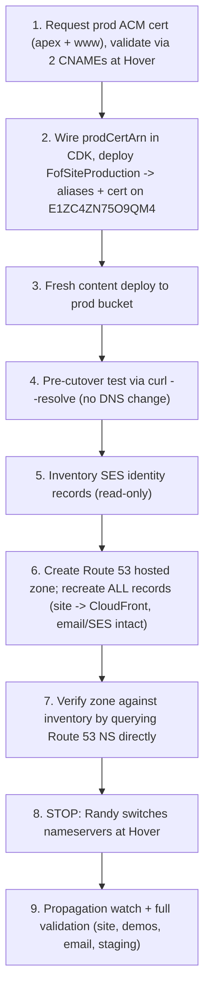

# Milestone M3 — Production Cutover to CloudFront via Route 53

## Context (verified 2026-07-03)
- M2 done: `staging.focusonfoundations.org` live on CloudFront with valid HTTPS; CDK `certificateArn` external-cert mode proven end-to-end.
- Production distribution `E1ZC4ZN75O9QM4` (`dulamv7pmn3ar.cloudfront.net`) exists but has no alias/cert; prod bucket holds a stale 2026-06-26 build.
- Decision made: **move DNS to Route 53** (Hover cannot point an apex at CloudFront — no ALIAS/CNAME-at-root; apex is the canonical URL and must serve HTTPS).
- Complete Hover zone inventory (8 records): apex A `198.202.211.1` (Webflow), `www` CNAME `cdn.webflow.com`, `staging` CNAME `d1w2h59hunmi32.cloudfront.net`, staging ACM validation CNAME, MX `mx.hover.com.cust.hostedemail.com`, `mail` CNAME `mail.hover.com.cust.hostedemail.com`, SPF TXT (`include:hover.com include:_spf.google.com include:amazonses.com`), `_dmarc` TXT. No DKIM on common selectors, no CAA, no SRV.
- **Email is live at Hover** (hostedemail.com) and **SES sends as this domain** (send-email Lambda; `amazonses.com` in SPF). Email hosting does not move — only the DNS records do.
- CORS: apex + www + staging already allow-listed in all six Lambdas (M1b). No Lambda work in M3.
- Hover gotcha from M2: never enter a trailing dot in record values at Hover.

## Sequence

## Step 1 — Production ACM cert (STOP: two Hover CNAMEs)
- `aws acm request-certificate --domain-name focusonfoundations.org --subject-alternative-names www.focusonfoundations.org --validation-method DNS --region us-east-1`.
- Read both `ResourceRecord`s (one per name; apex validation host has no subdomain suffix — at Hover the hostname will be just the `_<hash>` label, and `_<hash>.www` for www).
- STOP: Randy adds the two validation CNAMEs at Hover (**no trailing dot on values**). Poll until `ISSUED`.
- These validation CNAMEs are permanent (auto-renewal) and get copied into Route 53 in Step 6.

## Step 2 — Attach domains to prod distribution via CDK (commit)
- In [apps/focusonfoundations/infra/bin/fof-site.ts](apps/focusonfoundations/infra/bin/fof-site.ts): add `const prodCertArn = app.node.tryGetContext('prodCertArn');` and pass `certificateArn: prodCertArn` to `FofSiteProduction` (mirrors the staging wiring; `createDnsRecords` stays `false`). The stack class already supports it.
- Extend [apps/focusonfoundations/infra/test/static-site-stack.test.js](apps/focusonfoundations/infra/test/static-site-stack.test.js) with a production-mode assertion (two aliases, imported cert, zero Route 53 records). Run `npm test`.
- Commit: `Wire prodCertArn external-cert mode for production stack.`
- Deploy: `npx cdk deploy FofSiteProduction -c prodCertArn=<arn> --require-approval never` (us-east-1). Verify `E1ZC4ZN75O9QM4` has both aliases + cert.

## Step 3 — Fresh production content
- `cd apps/focusonfoundations/web && node scripts/save-deploy-config.js production && AWS_REGION=us-east-1 npm run deploy:production` — replaces the stale 2026-06-26 build, invalidates `/*`.

## Step 4 — Pre-cutover verification (no DNS change)
- Resolve a CloudFront edge IP for `dulamv7pmn3ar.cloudfront.net`, then `curl --resolve focusonfoundations.org:443:<ip> https://focusonfoundations.org/` (and www) — proves TLS + alias + content serve correctly for the real hostnames before touching DNS.
- Route checks + M1b fix marker, same as M2.

## Step 5 — SES record discovery (read-only)
- `aws sesv2 list-email-identities --region us-west-2` and `get-email-identity` for the domain (also check us-east-1): capture the `_amazonses.focusonfoundations.org` TXT and/or the three DKIM CNAMEs with random selectors, then `dig` each at `ns1.hover.com` to confirm what actually exists in the zone today.
- Anything found gets added to the Step 6 record set. If SES is verified per-address only (no domain records), note that and move on.

## Step 6 — Create and populate the Route 53 hosted zone
- `aws route53 create-hosted-zone --name focusonfoundations.org` (public). Record the zone ID and its four NS names.
- Create records (batch `change-resource-record-sets`):
  - apex **A + AAAA alias** → CloudFront `E1ZC4ZN75O9QM4` (alias hosted zone `Z2FDTNDATAQYW2`)
  - `www` A + AAAA alias → same distribution
  - `staging` CNAME → `d1w2h59hunmi32.cloudfront.net`
  - staging + prod ACM validation CNAMEs (from M2 and Step 1)
  - MX `10 mx.hover.com.cust.hostedemail.com`
  - `mail` CNAME → `mail.hover.com.cust.hostedemail.com`
  - apex TXT SPF (exact current value) and `_dmarc` TXT (exact current value)
  - any SES records from Step 5
- Keep `createDnsRecords: false` in CDK for M3 — records are CLI-managed this milestone; migrating record ownership into CDK is an M4/M5 item.

## Step 7 — Verify the zone before cutover
- Query the new zone's own NS directly (`dig @<awsdns-...>`) for every record and diff against the Hover inventory table. Email records must match byte-for-byte.
- STOP: show Randy the side-by-side comparison for approval before the nameserver switch.

## Step 8 — STOP: nameserver switch at Hover (the cutover)
- Randy changes the domain's nameservers at Hover from `ns1/ns2.hover.com` to the four Route 53 NS.
- Do NOT delete the Hover DNS zone records — leaving them intact makes rollback a pure nameserver switch-back.
- Note: NS delegation propagates over minutes-to-hours (registry TTL up to 48h worst case); downtime is acceptable per standing decision.

## Step 9 — Post-cutover validation
- Watch `dig +short NS focusonfoundations.org` until Route 53 NS appear; then apex/www resolve to CloudFront.
- Site: HTTPS + routes on apex and www; full QRAG flow from the apex origin (first live exercise); staging still works; live-site question flow end-to-end (Randy, browser).
- Email: Randy sends a test email to and from a `@focusonfoundations.org` address; confirm the send-email Lambda flow (share-by-email from a demo) still delivers (SES + SPF).
- Keep Webflow subscription and Hover zone records untouched for the rollback window.

## Step 10 — Docs, plan results, commits (commit)
- Update [apps/focusonfoundations/README.md](apps/focusonfoundations/README.md): prod cert ARN, `prodCertArn` deploy command, Route 53 zone ID + NS, the record table, cutover date, rollback procedure (switch NS back at Hover).
- Append M3 execution results + M4 carry-forwards to this plan file; commit and push.
- Rename this plan file to `2026-07-03_web-site-redo-fof_M3_production-cutover_<id>.plan.md` per convention.

## Rollback
- **Full rollback:** switch nameservers at Hover back to `ns1/ns2.hover.com` — the untouched Hover zone still points apex/www at Webflow. No AWS teardown needed.
- **Content-only:** redeploy a known-good `dist/` and invalidate `/*`.
- Email risk window: only between NS switch and propagation; records are copied byte-for-byte and verified in Step 7 beforehand.

## Acceptance
- `https://focusonfoundations.org` and `https://www.focusonfoundations.org` serve the Astro site from CloudFront with valid HTTPS.
- Full QRAG works from the apex origin; staging unaffected.
- Email to/from the domain works; demo share-by-email works.
- Hover zone intact for rollback; Webflow still cancellable later (M4).
- CDK tests extended and green; README documents the new prod + DNS state.

## M3 Execution Results (2026-07-03)
All ten todos completed. **`https://focusonfoundations.org` and `https://www.focusonfoundations.org` now serve the Astro site from CloudFront via Route 53.** Executed in Cursor thread [M3 production cutover](2dc9e7c3-8117-4f52-aa4c-25945edb646a).

Automated verification:
- Production ACM cert issued (us-east-1): `arn:aws:acm:us-east-1:[AWS-ACCOUNT-ID]:certificate/ce92bf3f-2f1d-4bdc-814e-2533499cca13` (`focusonfoundations.org` + `www.`).
- CDK `FofSiteProduction` deployed with `prodCertArn`; CloudFront `E1ZC4ZN75O9QM4` has both aliases + SNI cert (`Status: Deployed`).
- Fresh post-M1b build synced to prod bucket; CloudFront invalidated.
- Pre-cutover `curl --resolve` against a CloudFront edge IP: TLS + alias + content verified for apex and www before any DNS change.
- SES identity inventory found three DKIM CNAMEs; all copied byte-for-byte into Route 53 along with MX, SPF, DMARC, mail CNAME, staging CNAME, and three ACM validation CNAMEs (15 records total).
- Route 53 hosted zone `Z02230973OPK1REKMSJ5S` created; every record verified by querying the zone's own NS before cutover.
- Post-cutover: `dig +short NS focusonfoundations.org` returns Route 53 nameservers; apex/www A records resolve to CloudFront edge IPs; HTTP headers show `via: ...cloudfront.net` and `server: AmazonS3`.
- `https://staging.focusonfoundations.org` still works (staging CNAME migrated into Route 53).
- Infra CDK tests extended for production external-cert mode and pass; web unit tests 5/5 pass.

Randy's manual browser validation (all passed):
- Full QRAG flow on production apex origin: consent → name → question → excerpts + AI answer (new tab, hard refresh).
- Email to/from `@focusonfoundations.org` and demo share-by-email (SES) confirmed working.
- Console quiet on successful run (expected — see M1b differences; only `console.error` in catch blocks remain).

Commits (pushed to `feature/web-site-redo-fof`): `2c2f51d` Wire prodCertArn external-cert mode for production stack, `2061fad` Document M3 Route 53 cutover: zone, certs, record table, rollback.

### Issue encountered and resolved: prod ACM validation at Hover
Same trailing-dot gotcha as M2. Randy added both prod validation CNAMEs at Hover **without trailing dots** on the target values; ACM issued promptly. Validation CNAMEs were then copied into Route 53 before the nameserver switch so auto-renewal continues under the new DNS authority.

### Carry-forwards for M4
- **UX parity (from M1b):** name-field submit feedback, interim AI-wait message, accordion arrow sizing; optional debug logging behind a flag if wanted for troubleshooting.
- **Webflow decommission:** keep Hover zone + Webflow subscription through a rollback window, then cancel Webflow and archive `web-shared/webflow/`.
- **DNS ownership in CDK:** migrate the 15 Route 53 records from CLI-managed to `createDnsRecords: true` + import existing zone (or gradual CDK adoption).
- **Runbook consolidation:** single dev → staging → production doc now that DNS lives in Route 53.
- **`core/webflow_api.py`:** decide keep vs archive once Webflow is canceled.
- **Landing-page design pass** and AI-answer styling polish.

## Next Milestone Planning (M4 and beyond)
- M4 — Cleanup and UX polish: M1b UX-parity items (name-submit feedback, AI-wait message, accordion arrow), landing-page design pass, archive `web-shared/webflow/`, cancel Webflow after the rollback window, decide `core/webflow_api.py`, move Route 53 record ownership into CDK (`createDnsRecords: true` + import existing records), runbook consolidation.
- M5 (optional infra) — Backend deploy hardening: env-driven `ALLOWED_ORIGINS`, real `prod` stage in `.chalice/config.json`, idempotent prod deploy path replacing the init-only mirror script.

## Provenance
Planned and executed in Cursor thread [M2/M3 milestone work](2dc9e7c3-8117-4f52-aa4c-25945edb646a). Prior milestones: M1 `2026-06-26_web-site-redo-fof_M1_aws-astro-site_a75a8329`, M1b `2026-07-02_web-site-redo-fof_M1b_fix-demo-and-cors_80ee62b9`, M2 `2026-07-02_web-site-redo-fof_M2_staging_deploy_213f294f` (all in `.cursor/plans/`).

## Filename note
Plan file follows milestone convention: `2026-07-03_web-site-redo-fof_M3_production_cutover_5b3c136a.plan.md` (request ID `5b3c136a` preserved from generation).