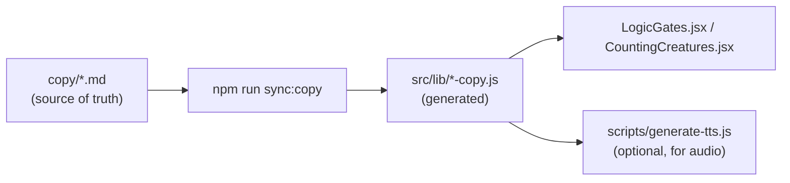

file: copy/applet-markdown-field-guide.md
title: Applet markdown field guide
last-updated: 2026-07-12_0656

Each applet has one copy file in this folder (`logic-gates.md`, `counting-creatures.md`). **Edit the markdown only** — do not hand-edit the generated `src/lib/<applet>-copy.js` modules.

After editing, propagate changes:

```bash
cd apps/focusonfoundations/web
npm run sync:copy
```

That runs `scripts/sync-applet-copy.js`, which parses the markdown and regenerates the `-copy.js` files the React applets import at runtime.


## How it flows



1. You change copy in `copy/<applet>.md`.
2. `npm run sync:copy` regenerates `src/lib/<applet>-copy.js`.
3. The applet reads titles, captions, and spoken lines from the generated module.
4. When **spoken** lines change, run TTS generation separately (see `apps/focusonfoundations/README.md` → Applets).


## Screen sections

Each `## Screen N` section matches **dot N** along the bottom of the applet (screen 1 = first dot).

| Field | Purpose |
|---|---|
| `title` | On-screen heading |
| `caption` | On-screen helper text below the circuit or activity |
| `speak` | Narration when the learner lands on that screen (also the TTS source for that intro) |
| `reveal-*` | Spoken line when the kid taps ? or reveals something (e.g. `reveal-switchOn`) |
| `display-*` | On-screen text shown after a reveal (Counting Creatures; may use `<br />` for line breaks) |
| `caption-OR`, `caption-AND`, etc. | Gate-specific captions on Logic Gates explore screens |
| `caption-bothOn`, `caption-revealed` | Extra captions on a single screen (see half-adder screen) |
| `title-quiz` | Quiz screen heading; use `{gate}` where the gate name is inserted |
| `title-quiz-done` | Heading when a multi-round quiz is finished |
| `title-quiz-done-not` | Heading when the NOT gate quiz is finished (single round) |
| `table-done` | Spoken line when the truth table is fully explored (Logic Gates gate screens) |
| `banner` | Prominent on-screen line after a reveal (e.g. two-switch wiring screen) |
| `button` | Button label (e.g. “See a real switch”) |
| `footer` | Closing line on a recap screen |

Use `{gate}` in `title` or captions where the applet substitutes NOT, OR, AND, XOR, or NAND.


## Shared section

`## Shared` holds lines reused across screens — quiz feedback, practice prompts, and similar.

Logic Gates examples: `quiz-correct`, `quiz-tryAgain`, `quiz-done`, `quiz-gotIt`.

Counting Creatures examples: `practice-makePebbles`, `practice-makeNumber`, `practice-correct`, `practice-tryAgain`.


## Templates section

`## Templates` holds dynamic lines with `{placeholders}` expanded at runtime.

Examples:

- `mysteryCorrect: Yes! It is the {gateName} gate!`
- `slothAnswer: Yes! A sloth has no single symbol for {target}, so it reuses its six symbols.`

After changing a **spoken** template or `speak` / `reveal-*` / `table-done` line, run `sync:copy`, then regenerate TTS for that applet if you want updated audio clips.
