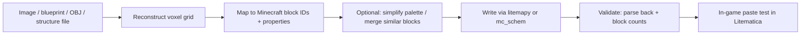

file: apps/minecraft/litematica/LITEMATIC_FORMAT.md
title: Litematica (.litematic) file format specification
last-updated: 2026-06-22_0800
ai: Cursor - Composer 2.5 Fast
session: Litematic format spec

# Litematica (`.litematic`) file format specification

Authoritative reference for humans and agentic coding systems that need to **read**, **write**, or **generate** Litematica schematic files programmatically — including pipelines that start from voxel data, procedural generators, or reconstructed 3D models/images.

**Mod:** [Litematica](https://github.com/maruohon/litematica) by masa (maruohon) — client-side schematic mod for Minecraft. Requires [malilib](https://github.com/maruohon/malilib).

**Example file in this repo:** [`examples/village-house.litematic`](examples/village-house.litematic)


## Quick facts

| Property | Value |
|----------|-------|
| File extension | `.litematic` |
| Outer wrapper | **gzip** compressed |
| Inner payload | **Named NBT** (tag type 10 = root Compound, empty name) |
| Block encoding | Palette + bit-packed `LongArray` (same idea as vanilla 1.13+ chunk sections) |
| Multi-region | Yes — one schematic can contain many named sub-regions |
| Official published spec | **None** — this doc synthesizes author notes, source code, and library implementations |

There is **no** separate “Lightmatic” format; the mod and files are **Litematica**.


## External references

| Resource | URL | Notes |
|----------|-----|-------|
| Litematica mod repo | https://github.com/maruohon/litematica | Reference Java implementation |
| Format explanation (issue #53) | https://github.com/maruohon/litematica/issues/53 | masa’s direct description of block storage |
| litemapy docs | https://litemapy.readthedocs.io/en/latest/litematics.html | Python read/write; good secondary spec |
| litemapy (PyPI) | https://pypi.org/project/litemapy/ | Recommended Python library |
| mc_schem (Rust) | https://docs.rs/mc_schem/latest/src/mc_schem/schem/litematica.rs.html | Rust load/save reference |
| oriumgames/schem | https://github.com/oriumgames/schem | Multi-format library; notes v6/v7 |
| Minecraft data versions | https://minecraft.wiki/w/Data_version | Map `MinecraftDataVersion` ↔ game release |
| NBT format (wiki) | https://minecraft.wiki/w/NBT_format | Tag types, endianness |
| NBTExplorer | https://github.com/jaquadro/NBTExplorer | Inspect gunzipped `.litematic` visually |


## File envelope

### On disk

```
.litematic file
└── gzip stream
    └── NBT File (named root Compound)
```

1. **Detect gzip:** magic bytes `1F 8B`.
2. **Decompress** with standard gzip (`gzip -dc`, `GzipFile`, `flate2::GzDecoder`, etc.).
3. **Parse** the result as **named NBT** (big-endian, length-prefixed UTF-8 tag names).

### Verify an unknown file

```bash
file path/to/example.litematic          # expect "gzip compressed data"
gzip -dc path/to/example.litematic | xxd | head   # first payload byte 0x0a = Compound
```

Gunzip to raw NBT for editors:

```bash
gzip -dc examples/village-house.litematic > /tmp/village-house.nbt
```


## Root NBT structure

```
Root Compound "" 
├── Version              Int       # Litematica schematic format version (6 or 7 today)
├── SubVersion           Int       # Optional sub-version (often 1 on v7 files)
├── MinecraftDataVersion Int       # Vanilla data version — MUST match target MC version
├── Metadata             Compound  # Human metadata + computed bounding-box stats
└── Regions              Compound  # Map of regionName → region Compound
```

### Version fields

| Tag | Meaning |
|-----|---------|
| `Version` | **Litematica format version**, not the mod jar version. Current saves use **7** (v6 still appears in older files). |
| `SubVersion` | Minor format revision within `Version`. Example file uses **1**. |
| `MinecraftDataVersion` | Vanilla [data version](https://minecraft.wiki/w/Data_version) integer. Block IDs, block properties, and tile-entity schemas depend on this. |

**Java Edition 26.1.2** → `MinecraftDataVersion = **4790**` (protocol 775).

When generating files for a target Minecraft version, **always set this correctly**. Wrong values cause missing blocks, renamed IDs, or broken tile entities on paste.


## Metadata compound

Stored at `Metadata`. Litematica and libraries populate most fields automatically on save.

| Tag | Type | Description |
|-----|------|-------------|
| `Name` | String | Schematic display name |
| `Author` | String | Free-text author |
| `Description` | String | Free-text description |
| `TimeCreated` | Long | Epoch milliseconds (UTC) |
| `TimeModified` | Long | Epoch milliseconds (UTC) |
| `RegionCount` | Int | Number of sub-regions |
| `TotalBlocks` | Int | Count of **non-air** blocks across all regions |
| `TotalVolume` | Int | Product of enclosing box dimensions |
| `EnclosingSize` | Compound `{x,y,z}` | Axis-aligned bounding box size (absolute dimensions) |
| `Preview` | ByteArray | Optional preview image (often empty; partial library support) |
| `Software` | String | Optional; some tools add e.g. `litemapy` |

Agents generating files should compute `EnclosingSize`, `TotalVolume`, `TotalBlocks`, and `RegionCount` consistently with region geometry and block data.


## Regions

Each entry in `Regions` is a **named sub-region** (string key → Compound). Complex builds can split wings, floors, or redstone modules into separate regions with different positions.

### Per-region tags

| Tag | Type | Description |
|-----|------|-------------|
| `Size` | Compound `{x,y,z}` | Region dimensions in blocks; **any axis may be negative** |
| `Position` | Compound `{x,y,z}` | Region origin corner in schematic space |
| `BlockStatePalette` | List[Compound] | Unique block states; index = palette ID |
| `BlockStates` | LongArray | Bit-packed palette indices, one per block in region volume |
| `Entities` | List[Compound] | Entities (mobs, items, etc.) with relative `Pos` |
| `TileEntities` | List[Compound] | Block entities (chests, beds, signs, …) with `x`,`y`,`z` |
| `PendingBlockTicks` | List[Compound] | Scheduled block ticks (optional) |
| `PendingFluidTicks` | List[Compound] | Scheduled fluid ticks (optional) |

### Coordinate systems

Each region has:

1. **Local coordinates** within the region volume (derived from `Size`).
2. **Schematic coordinates** — local origin placed at `Position`.

**Positive size** (e.g. `{x:7, y:5, z:7}`): local coords run **0 … size−1** on each axis.

**Negative size** (e.g. `{x:-7, y:7, z:-7}`): local coords run **size+1 … 0** instead. Example: `x: -7` → local x ∈ **[-6, 0]**. This records selection-box orientation when the player saved from the “negative” corner.

**Schematic-space bounds** for negative sizes:

```
x: [Position.x + Size.x + 1, Position.x]
y: [Position.y, Position.y + Size.y - 1]   (when Size.y > 0)
z: [Position.z + Size.z + 1, Position.z]
```

Libraries like litemapy hide this; hand-rolled writers must implement it correctly.

### Region volume

```
volume = |Size.x| × |Size.y| × |Size.z|
```

The `BlockStates` array must contain exactly `volume` palette indices (after decoding).


## Block storage (critical section)

Block data mirrors **vanilla Minecraft 1.13+ chunk section** encoding. See [issue #53](https://github.com/maruohon/litematica/issues/53#issuecomment-514456789).

### BlockStatePalette

List of Compounds, one per unique block state in this region.

**Palette entry shape:**

```
Compound
├── Name        String     e.g. "minecraft:oak_stairs"
└── Properties  Compound   optional; property name → string value
```

Example:

```
Name: "minecraft:oak_stairs"
Properties: { half: "bottom", facing: "south", shape: "straight", waterlogged: "false" }
```

**Rule:** palette index **0 is always `minecraft:air`**, even if the build contains no air blocks. All other states follow in arbitrary order (typically order of first appearance when saving from game).

Property values are **strings** in NBT (`"north"`, `"true"`, etc.), not numeric enums.

### BlockStates (bit-packed long array)

For each block position in the region, store a palette index using `bitsPerEntry` bits, packed into a Java-style `long[]` (signed 64-bit values; treat bits as unsigned when decoding).

**Bits per entry:**

```
bits = max(2, ceil(log2(palette_size)))
```

Palette size includes the forced air entry at index 0. Example: 24 palette entries → need 5 bits (2^5 = 32 ≥ 24).

**Long array length:**

```
long_count = ceil(volume * bits / 64)
```

### Iteration order (block index layout)

When packing or unpacking, increment block index in this order (matches vanilla sections and mc_schem):

```
for y in 0 .. |Size.y| - 1:
  for z in 0 .. |Size.z| - 1:
    for x in 0 .. |Size.x| - 1:
      block_index += 1
```

**X varies fastest, then Z, then Y.**

When `Size` is negative on an axis, libraries map world/local coords to array indices internally; do not assume raw 0..|size|−1 world coords without applying the negative-size rules above.

### Decode algorithm (pseudocode)

```python
def decode_block_states(longs, bits, volume):
    mask = (1 << bits) - 1
    ids = []
    for i in range(volume):
        bit_start = i * bits
        long_index = bit_start // 64
        bit_offset = bit_start % 64
        value = (longs[long_index] >> bit_offset) & mask
        if bit_offset + bits > 64:
            spill = bits - (64 - bit_offset)
            value |= (longs[long_index + 1] & ((1 << spill) - 1)) << (64 - bit_offset)
        ids.append(value)
    return ids
```

### Encode algorithm (summary)

1. Build palette: insert `minecraft:air` at index 0; dedupe all other states.
2. Compute `bits = max(2, ceil(log2(len(palette))))`.
3. Allocate bit buffer of length `volume * bits`.
4. Walk positions in **Y → Z → X** order; write palette index for each cell.
5. Pack bits into `long[]`; serialize as NBT `LongArray`.


## Tile entities

Blocks like beds, chests, signs, banners, and skulls often need **both**:

- A **block state** in the palette (e.g. `minecraft:white_bed` with `part`, `facing`), **and**
- A **tile entity** record in `TileEntities`.

Typical tile entity compound:

```
id: "minecraft:bed"
x, y, z: Int   # position within region local coords
... block-specific NBT ...
```

On modern Minecraft (1.20.5+), item-related data may appear under a `components` compound (data-driven item components). The example schematic’s beds use this pattern.

**Agent guidance:** if paste shows wrong bed color, empty chests, or blank signs, check tile entity NBT — not just block states.


## Entities

Each entity is a Compound in `Entities`, usually including:

- `Id` or entity type identifier (format varies by MC version)
- `Pos`: List of 3 Doubles (relative position)
- `Rotation`, `Motion`, and type-specific tags

litemapy has **partial** entity support; test in-game after generation.


## Pending ticks

`PendingBlockTicks` and `PendingFluidTicks` store scheduled updates so pasted structures resume ticking (water flow, redstone, etc.). Each entry typically includes position (`x`,`y`,`z`), priority, time, and block/fluid id.

Often empty for static builds. litemapy partial support.


## Worked example: `examples/village-house.litematic`

Parsed values from the bundled example (MC **26.1.2**):

| Field | Value |
|-------|-------|
| Compressed size | 904 bytes |
| Decompressed NBT | 3,010 bytes |
| `Version` | 7 |
| `SubVersion` | 1 |
| `MinecraftDataVersion` | 4790 |
| `Metadata.Name` | `Unnamed` |
| `Metadata.Author` | `rjcomp` |
| `Metadata.RegionCount` | 1 |
| `Metadata.TotalBlocks` | 159 (non-air) |
| `Metadata.TotalVolume` | 343 (= 7³) |
| `Metadata.EnclosingSize` | x=7, y=7, z=7 |
| `Metadata.TimeCreated` | 2026-06-22 (epoch ms 1782128300605) |

### Region `Unnamed`

| Field | Value |
|-------|-------|
| `Position` | x=6, y=0, z=6 |
| `Size` | x=−7, y=7, z=−7 |
| Effective schematic bounds | x: 0…6, y: 0…6, z: 0…6 |
| Palette entries | 24 (including forced air at [0]) |
| Bits per block | 5 |
| `BlockStates` longs | 27 |
| `Entities` | 0 |
| `TileEntities` | 2 (`minecraft:bed`) |
| Pending ticks | 0 |

### Palette summary (index → block)

| Idx | Block |
|-----|-------|
| 0 | `minecraft:air` (forced) |
| 1 | `minecraft:short_grass` |
| 2–23 | oak stairs (many facing/shape variants), stripped oak log, cobblestone, oak planks, mossy cobblestone, oak door (upper/lower), white bed (head/foot), wall torch, glass pane variants |

### Block counts (decoded)

| Count | Block |
|-------|-------|
| 184 | air |
| 38 | cobblestone |
| 33 | oak planks |
| 16 | stripped oak log |
| 11+ | various oak stairs |
| 6 | short grass |
| 5 | mossy cobblestone |
| 2 | wall torch, glass pane, … |

Use this file as a **golden sample** when validating a new parser or generator: decompress, parse NBT, decode 343 indices, confirm palette size 24 and 159 non-air blocks.


## Creating `.litematic` files from scratch

### Path 1 — In-game (simplest)

1. Build or select an area in Minecraft with Litematica installed.
2. Save schematic to the `schematics/` folder.
3. Litematica writes a valid gzip+NBT file with correct versions and tile entities.

Use this to produce **reference files** for testing generators.


### Path 2 — Python with litemapy (recommended for agents)

Install: `pip install litemapy` (requires `nbtlib`).

Minimal generator:

```python
from litemapy import Schematic, Region, BlockState

# Region(x, y, z, width, height, depth) — origin + positive sizes
reg = Region(0, 0, 0, 7, 7, 7)
schem = reg.as_schematic(
    name="village-house",
    author="agent",
    description="Generated by script",
)

reg[0, 0, 0] = BlockState("minecraft:cobblestone")
reg[3, 1, 3] = BlockState("minecraft:oak_planks")

# litemapy handles palette, bit packing, Metadata, gzip
schem.save("out.litematic")
```

**Agent checklist when using litemapy:**

- Set or verify `MinecraftDataVersion` for target MC (may require setting on `Schematic` metadata before save — check litemapy version API).
- For blocks with properties: `BlockState("minecraft:oak_stairs", {"facing": "south", "half": "bottom", "shape": "straight", "waterlogged": "false"})` — use exact property names/values from vanilla.
- Tile entities / entities: limited support — test pasted result in-game.
- Compare output size/structure to `examples/village-house.litematic` via NBT explorer.


### Path 3 — Rust with mc_schem

See [litematica.rs](https://docs.rs/mc_schem/latest/src/mc_schem/schem/litematica.rs.html) for `from_litematica_file` / `save_litematica_file` and `MultiBitSet` bit packing. Good for performance-critical generators integrated with Rust tooling.


### Path 4 — Raw NBT (expert / last resort)

Implement the full pipeline:

1. Build voxel model (3D array of block states).
2. Split into one or more regions with `Size` / `Position`.
3. Per region: palette + bit pack + optional tile entities / entities / ticks.
4. Assemble root + `Metadata` + `Regions`.
5. Serialize named NBT → gzip.

Common failure modes:

- Wrong Y/Z/X iteration order → structure looks “sheared” or scrambled.
- Missing air at palette[0].
- `bits` too small or wrong long array length.
- Negative `Size` mishandled → wrong placement on paste.
- Stale block names for the `MinecraftDataVersion`.
- Tile entity missing for beds, chests, signs.


## Agent workflows: images and other sources

There is **no** standard path from a photo/image directly to `.litematic`. Typical agent pipelines:



### Recommended stages

1. **Voxelization** — convert input to a dense 3D grid of intended blocks (resolution = 1 block per cell unless subsampling).
2. **Block mapping** — choose a block palette appropriate to the style (e.g. oak + cobblestone for rustic houses). Map RGB/material clusters to block types; use stairs/slabs for slopes.
3. **Property inference** — stairs need `facing` and `shape`; logs need `axis`; doors need `half` + `hinge`; beds need head/foot pairs.
4. **Tile entities** — add bed/chest/sign NBT where block states alone are insufficient.
5. **Metadata** — set `MinecraftDataVersion`, author, name; compute totals.
6. **Validation** — round-trip parse; compare `TotalBlocks`, dimensions, palette size; optionally diff against a known-good example.
7. **In-game verification** — load in Litematica on the target MC version; paste in creative; fix mapping errors.

### Block name reference for modern MC

Use version-specific registries:

- [minecraft.wiki block pages](https://minecraft.wiki/w/Block) for IDs and property names.
- [prismarinejs/minecraft-data](https://github.com/prismarinejs/minecraft-data) for programmatic block state lists by version.

Always target the **`MinecraftDataVersion`** you encode in the file (4790 for 26.1.2).


## Validation checklist (for agents)

Before committing a generated `.litematic`:

- [ ] File begins with gzip magic `1F 8B`.
- [ ] Root NBT parses; required keys present: `Version`, `MinecraftDataVersion`, `Metadata`, `Regions`.
- [ ] `MinecraftDataVersion` matches intended game version (4790 for 26.1.2).
- [ ] Every region: `|Size.x|×|Size.y|×|Size.z|` equals decoded `BlockStates` count.
- [ ] Palette index 0 is `minecraft:air`.
- [ ] `Metadata.TotalBlocks` equals non-air count across regions.
- [ ] `Metadata.EnclosingSize` matches axis-aligned bounds of all regions.
- [ ] Tile entities exist for blocks that require them (beds, chests with loot, signs with text).
- [ ] Round-trip: load with litemapy (or parse NBT) without error.
- [ ] Optional: paste in Litematica on target Minecraft version.


## Tooling commands

```bash
# Inspect file type
file apps/minecraft/litematica/examples/village-house.litematic

# Decompress to raw NBT for NBTExplorer
gzip -dc apps/minecraft/litematica/examples/village-house.litematic > /tmp/village-house.nbt

# Quick parse with repo venv (nbtlib installed)
.venv/bin/python3 - <<'PY'
import gzip, io
from nbtlib import nbt
p = "apps/minecraft/litematica/examples/village-house.litematic"
with gzip.open(p, "rb") as f:
    root = nbt.File.parse(io.BytesIO(f.read()))
print("Version", root["Version"], "MC data", root["MinecraftDataVersion"])
print("Regions", list(root["Regions"].keys()))
PY
```


## Version history notes

| Litematica `Version` | Notes |
|---------------------|-------|
| 6 | Older schematic saves; still supported by some libraries |
| 7 | Current format for recent Litematica builds; example file uses v7 + `SubVersion` 1 |

When in doubt, **save a tiny test schematic from your installed Litematica** on the target Minecraft version and match its `Version`, `SubVersion`, and `MinecraftDataVersion` fields.


## Related formats (not interchangeable)

| Format | Extension | Notes |
|--------|-----------|-------|
| Sponge schematic | `.schem` | Different NBT layout; SpongePowered spec |
| Legacy MCEdit | `.schematic` | Pre-1.13 block IDs + metadata bytes |
| Axiom | `.axiom` | Different tool; chunk-based |

Convert between formats with dedicated tools (e.g. oriumgames/schem, WorldEdit where supported) — do not assume structural compatibility.


## Summary for coding agents

1. A `.litematic` is **gzip + named NBT**, not raw NBT.
2. Blocks live in **regions**; each region uses **palette + bit-packed BlockStates** with **air at palette index 0**.
3. Pack/unpack block order: **Y outer, Z middle, X inner**.
4. Set **`MinecraftDataVersion`** to match the Minecraft version you target (4790 = Java 26.1.2).
5. Prefer **litemapy** (Python) or **mc_schem** (Rust) over manual NBT.
6. Use [`examples/village-house.litematic`](examples/village-house.litematic) as a regression fixture.
7. Always validate with an in-game Litematica paste before treating generated schematics as production-ready.
