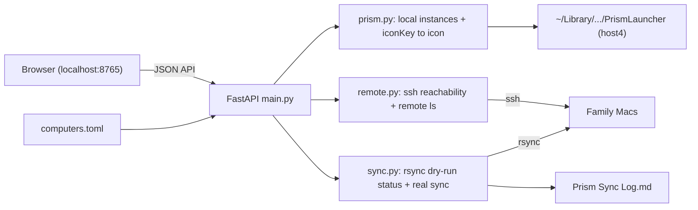

## Prism Sync Web App - Build Plan (Milestone 1)

Turn the one-off [prism-sync.sh](apps/minecraft/mac-scripts/prism-sync.sh) into a small local web app: a computers-by-instances matrix that shows which Macs are reachable, which instances they have, whether each is in sync, and lets Randy push selected instances from his master laptop to the family Macs. Detailed design lives in the SPEC (moved from the file created last turn).

### Decisions locked (from Q&A)
- **Computers** (source: [plans/computer-info.md](plans/computer-info.md)): `host4` (master, user `randytrue`), then columns in order `host1`/`Kid1`, `host3`/`carer`, `host2`/`tl-user`, `host5` (Kid1's laptop - the "itmvp20" typo; still TBD in computer-info.md, include as a disabled placeholder).
- **App folder:** new `apps/minecraft/prism-sync/`. Move the script, log, and existing markdown docs into it and organize freely. `mac-scripts/` goes away.
- **Docs naming:** rename the spec created last turn to `SPEC.md`; add a `README.md` (Randy's standard pair). This CreatePlan output is the separate plan doc.
- **Config source of truth:** a new `computers.toml` (chosen over parsing the bash arrays) - clean, typed, drives both computers and filters. The bash script becomes a frozen fallback.
- **Port:** `8765` (configurable). Distinct from math-quiz's `8907` and Minecraft's `25565`.
- **Stack:** Python + FastAPI + uvicorn backend, static vanilla HTML/CSS/JS frontend, shelling out to the existing `ssh`/`rsync` (reuses the SSH keys already set up).

### Target folder structure
```
apps/minecraft/prism-sync/
  prism-sync.sh                    # moved; legacy CLI fallback
  Prism Sync Log.md                # moved; shared sync log (CLI + web append)
  SPEC.md                          # renamed from 2026-07-01 web-app spec; living source of truth
  2026-05-22_prism-sync-setup.md   # moved; family-Mac SSH setup plan
  README.md                        # new; how to run web app + CLI
  computers.toml                   # new; canonical computers + filters + excludes + port
  server/{__init__,main,config,prism,remote,sync}.py
  web/{index.html,app.js,styles.css}
  tests/{test_config,test_prism,test_sync}.py
```

### Architecture / data flow


### API endpoints (draft)
- `GET /api/config` - computers (order, enabled), includes/excludes, exclude-folder chips, port.
- `GET /api/instances` - local instances (name, iconKey, sort key).
- `GET /api/icon/{instance}` - resolved icon bytes.
- `POST /api/reachability` - ssh-check computers -> online/offline (Refresh button).
- `POST /api/status` - per-instance status across enabled+reachable computers (Check Status button).
- `POST /api/status/instance` - status for one instance (row-click fast path).
- `POST /api/sync/preview` - rsync dry-run for selected instances x enabled computers.
- `POST /api/sync/apply` - real sync after confirm; append to the markdown log.

### Key implementation notes
- **Reachability:** `ssh -o BatchMode=yes -o ConnectTimeout=3 user@host true`, run per computer in parallel.
- **Sync status:** reuse the script's `rsync -az --delete --itemize-changes` + the exact `RSYNC_EXCLUDES` (lines 69-76) as a dry-run; empty change set = in sync, non-empty = differs, missing dir = not present. Extra rows (instances a Mac has that host4 doesn't) come from `ls` over ssh.
- **Icons:** parse `iconKey` from each `instance.cfg`, resolve against the shared `icons/` library, fall back to `minecraft/icon.png` then a default.
- **Direction:** one-way push `host4` -> targets, same as the script. Preview-then-confirm before real sync. Toggling a computer OFF grays its column and excludes it as a target.

### UI (Milestone 1)
Top panel: options (`--update-existing`, include/exclude filters, icon-sync), read-only exclude-folder chips (`saves`, `screenshots`, `logs`, `crash-reports`, `config/options.txt`, `options.txt`), per-computer ON/OFF toggles, `Refresh` (manual reachability only - no auto-timer), `Check Status` (fills the matrix; off by default). Matrix: instance rows (icon + name, A->Z) x computer columns; reachability header row; cell states in-sync / differs / missing / present / unreachable / unknown / grayed. Click a row to populate its status; multi-select rows + Sync to push.

### Testing (per repo pre-PR policy)
Unit tests for config loading, instance discovery, iconKey resolution, and rsync-output -> cell-state parsing; one mocked end-to-end status/sync path (ssh/rsync stubbed). Run with `.venv/bin/python3 -m pytest apps/minecraft/prism-sync/tests`.

### Next steps / later milestones
- **M2 - mods & saves detail:** foldable columns to the right of the matrix showing an instance's mods and saved worlds (read-only inspection). Layout provisional.
- **M3 - per-mod view & sync (separate plan):** select a mod, see which instances have it and the latest version, update instances to the latest - keyed on framework (Fabric/Forge) + version. MathQuest is the driving example but code works for any mod; mostly `.jar` metadata reading + copying. Warrants its own plan.