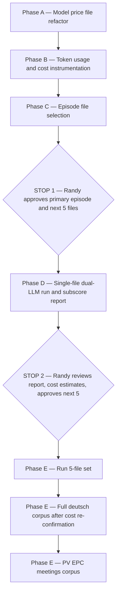

file: apps/transcription/stellar-transcriber/docs/2026-07-03_milestone-3b-plan.md
title: Stellar Transcriber — Milestone 3B plan: dual-LLM merge scoring
last-updated: 2026-07-03_1250
ai: Cursor - Composer 2.5 Fast
session: `Stellar Transcriber M3B — dual-LLM merge scoring`

Milestone 3B of the Stellar Transcriber project. Builds on M3 pipeline code (`core/denovo.py`, M2 eval harness). Design of record: M3B cursor plan. Working branch: `stellar-transcriber-start`.

## Milestone 3B objective
Run and score the **dual-LLM** transcript merge (`_nova2gen` + `_dgwhspm` → `_draftld`) against `_vrb` ground truth, with full subscore reporting and token/cost instrumentation. Scale: single file → 5 files → full deutsch corpus → pv EPC. No audio or Deepgram — inputs are local raw markdown only.

## Phases

### Phase A — Model price refactor
- `core/llm_model_prices.json` replaces hardcoded `TOKEN_PRICE_DICT` in `core/llm.py`.
- `scripts/update_llm_model_prices.py` refreshes prices from Nous inference API (adapted from `agents/hermes/nous_portal_model_prices.py`).
- Update `config/denovo-pipeline.json` model tiers to current cheap/standard models.

### Phase B — Token usage and cost instrumentation
- Capture actual input/output tokens from OpenAI/Anthropic API responses in denovo LLM calls.
- `merge_dual_llm` records cost summary in draft metadata; pre-run estimate helpers for island content.

### Phase C — Episode selection (STOP 1)
- Verify `BATCH_DEUTSCH_LAST_10` file availability; propose primary + next 5.
- Report in `references/m3b-episode-selection.md`; wait for Randy approval before LLM runs.

### Phase D — Single-file run (STOP 2)
- Score baselines (`_nova2gen`, `_dgwhspm`), `_draftdd`, `_draftld` on primary episode vs `_vrb`.
- Report all subscores + actual cost; estimate 5-file and full-corpus cost.

### Phase E — Scale-up
- 5-file set after go-ahead; full deutsch corpus after cost re-confirmation; pv EPC (19 pairs).

### Tests
- Extend `tests/test_stellar_denovo.py` for price loading, usage accumulation, cost metadata.

## Workflow

## To-dos (Milestone 3B)
- [ ] Phase A: model price file + loader + update script
- [ ] Phase B: usage instrumentation + estimate helpers
- [ ] Phase C: episode selection report (STOP 1)
- [ ] Phase D: single-file run report (STOP 2)
- [ ] Phase E: 5-file, deutsch corpus, pv runs
- [ ] Tests
