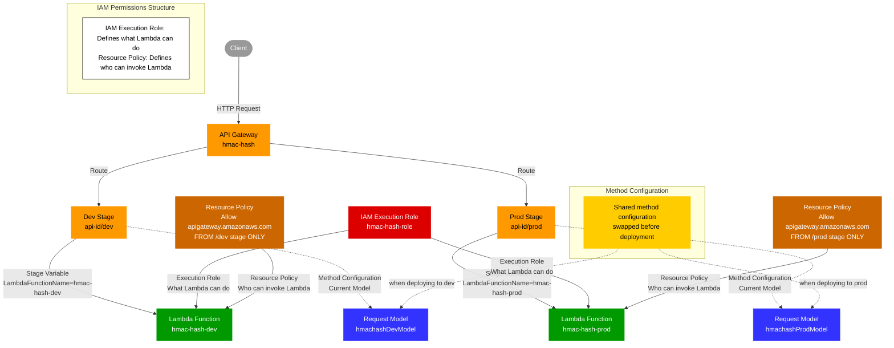
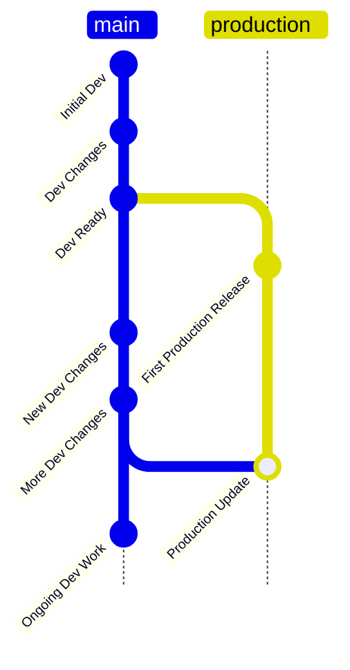
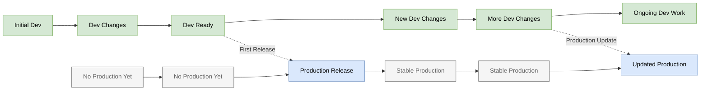

# Dev to Prod Flow 2026-03-21: qrag-llm model update to gpt-5.4 with reasoning_effort
[x] do local mtests on python code with changes
   - ran qrag_2step via mrun_qrag_batch_fda_townhalls in corpuses.py with gpt-5.4
[x] deploy to dev with chalicelib_mirror_deploy.sh for qrag-llm (deployed 3 times, see notes)
   - command: `cd web/aws_chalice/qrag-llm && ../chalicelib_mirror_deploy.sh`
   - set_request_validation automatically runs from script to update the API Gateway request validation schema
   - no need to deploy qrag-routing since that code didn't change
[x] run aws_valid.py/mrun_test_lambda_requests with env='dev' and set cur_app_name='qrag-llm' (line 989)
   - all 20 tests passed after fixes below
[x] run aws_valid.py/mrun_sub_prod_api_urls_for_dev
   — takes the prod JS file (webflow-rag-devpage.js) and creates a copy with dev API Gateway URLs substituted in, saved as webflow-rag-devpage_dev-api-urls.js
[x] update webflow DEV page custom code with _dev-api-urls.js version and publish to staging
[x] test live dev page from staging site
[x] run aws_valid.py/mrun_generate_api_state_report for qrag-llm and review
[SKIP] update webflow code on real pages — no JS changes in this deployment (this step is for when JS changes, save in Webflow but don't publish until after Lambda promote)
[SKIP] run aws_valid.py/mrun_set_request_validation for qrag-llm-prod — schema didn't change, new JSON fields are output-only
[ ] run aws_valid.py/mrun_promote_to_prod for qrag-llm
   - copies the Lambda deployment zip from the latest dev deployment to the prod Lambda function; zip_path=None means it auto-finds the zip from the last dev deployment log
[SKIP] publish webflow — no prod JS changes in this deployment
[x] test all pages on real site

## Troubleshooting notes 2026-03-21
### tiktoken Lambda import failure
Deploy 1 failed all Lambda tests with `No module named 'tiktoken'`. Chalice can't cross-compile tiktoken's native C/Rust extensions on macOS for the Lambda Linux runtime. The fix had two parts:
- Changed `import tiktoken` to `try/except ImportError` in `chalicelib/llm.py` header (the section above `# ---START OF SYNCED CODE---`). Important: editing `primary/llm.py` alone does NOT fix this because the deploy script only syncs code below the delimiter — the chalicelib header is preserved separately.
- Commented out `tiktoken` in `web/aws_chalice/qrag-llm/requirements.txt` to suppress the Chalice packaging warning. tiktoken is not needed in the Lambda; it's only used by `count_tokens()` for local offline cost estimation.

### Expired JWT token
The test JWT (`JWT_03-24` in .env, referenced by `aws_valid.py` line 28) had expired June 2025. Generated a new one via `mrun_generate_and_verifyjwt` in `primary/aws.py` and updated `.env`.

### reasoning_effort incompatible with fallback model
Deploy 2 passed clean tests 1-2 but test 3 (retry flag) failed with `BadRequestError`. The retry used `FALLBACK_MODEL = "gpt-4o"` which doesn't support the `reasoning_effort` parameter. Fix: changed fallback to `gpt-5.4` with `FALLBACK_REASONING_EFFORT = "low"` in `app.py`, so retries use the same model but with lower reasoning effort for faster response.

### Timeout at medium reasoning on staging
Deploy 3 worked but timed out at 23s with `REASONING_EFFORT = "medium"`, falling back to low. Changed to `REASONING_EFFORT = "low"` as default, `FALLBACK_REASONING_EFFORT = None` (no reasoning) for retry. Both still use gpt-5.4.


# Diagrams
## AWS dev and prod setup

## Basic dev to prod flow


## Local and Backend dev to prod flow


# Problems for followup
## Both CORS and LWT are implemented in lambda code but should be at API Gateway level

# Add to API State Report
[ ] add is_same_lambda_code comparison of latest zip to both dev and prod
[ ] create is_same_validation_model_schema
   [ ] add to api state report

# Dev to Promote to Prod Flow
[x] do local mtests on python code with changes
[x] deploy to dev with chalicelib_mirror_deploy.sh for all app_names
   [x] qrag-routing
   [x] qrag-llm
   - set_request_validation automatically runs from script to update model schema
[x] mrun test_lambda_requests with env=dev for all/both apps being promoted
[x] mrun sub_prod_api_urls_for_dev
[x] update webflow DEV page custom code with _dev-api-urls.js version
[x] deploy to staging
[x] test unlinked -dev page from staging site
[x] mrun generate_api_state_report for all/both apps and review
[x] update webflow code on real pages (prod versions), save but do NOT publish (publish after Lambda promote)
[x] mrun set_request_validation for -prod if needed (ran after for multi-q and did additional version of qrag-llm)
[x] mrun promote_to_prod! (with zip_path=None) for all/both app_names (qrag-routing and qrag-llm)
[x] publish webflow to both staging and real sites
[ ] test all pages on real site


# Task Lists
## NEXT LAMBDA CHECKLIST FOR PROD INIT
[x] change cur_app_name in aws_valid.py
[x] find latest local deployment zip and rename 'prod-init-promote_DATETIME_...'
[x] paste in path for PROMOTE_TO_PROD_ZIP_PATH
[ ] check last updated comment in app.py and in deployed lambda code and compare to last modified in AWS console vs last deployment zip
   - make entry in composite log (follow qrag-routing)
[x] mrun generate_api_state_report
    [x] review IAM policies and paste in inline policy
    [x] review resource-based policies and __delete ApiGatewayInvoke__
[x] copy into chalice.json the prod stage env variables
[x] script deploy to with 'prod' at end
[x] delete from chalice.json the prod stage env variables
[x] confirm new api gateway (no -prod) and lambda (-prod) are in aws console
__Check to see if the IAM role -prod is assigned to the new -prod lambda__ YES it is
[x] mrun rename_api_gateway on new one (paste in new id and name)- confirm in aws console
[x] update aws_valid.py GLOBALS
   - add API_ENDPOINT_MYAPP_PROD (make sure it has route at end, get from Stages > POST > Invoke URL)
   - add in API_NAME_GLOBALS_MAPPING
   - add in APIS_VALIDATION_ENABLED
[x] mrun copy_lambda_dev_role_to_prod - confirm in console
in AWS Console:
[x] set WAF to Firs-Web-ACL in AWS console in API Gateway > Stage
[x] create new CloudWatch log group for API Access (copy '_prod-prod' name, expire 1 mo) - afterwards copy that ARN
[x] set CloudWatch logging in API Gateway > Stage > Logging
   - paste in ARN  but delete trailing ':*'
   - paste in schema: { "requestId": "$context.requestId", "ip": "$context.identity.sourceIp", "userAgent": "$context.identity.userAgent", "requestTimeUtc": "$context.requestTime", "requestTimeEpoch": "$context.requestTimeEpoch", "httpMethod": "$context.httpMethod", "resourcePath": "$context.resourcePath", "status": "$context.status", "responseLength": "$context.responseLength", "errorMessage": "$context.error.messageString", "integrationError": "$context.integrationErrorMessage", "responseBodySnippet": "$context.integration.response.body" }
[x] deploy from Resources (description: "set WAF ACL and loggging" or if forget and is blank it's OK)
[x] mrun set_request_validation (make sure -prod is uncommented)
   - afterwards check in aws console, Resources > POST > Request validator: validate-body and check Models
[x] mrun test_lambda_requests with single clean request (comment others out)
   - needed to trigger lambda log group creation
[x] mrun generate_api_state_report - compare if all same
   - validation schema will be different (select schema and use Find to confirm there are 2 in file, if only 1 then copy api state report as _dev and _prod version with only those sections and compare to get diff view)
   - if needed revert schema and test_requests back to what it was temporarily and run set_request_validation again (confirm change in console)
[x] run is_same_lambda_code_zip_vs_deployed
   - dev should be True
   - prod if False then:
   [x] __mrun promote_to_prod with this zip__
   [x] run is_same_lambda_code_zip_vs_deployed again to confirm both -dev and -prod are same
[x] mrun test_lambda_requests with prod - single clean first, 
[x] mrun test_lambda_requests with prod - uncomment and run all requests
[x] update to prod url ONLY in webflow custom code (one page for rag) and publish to staging  
    [x] test with user api call on staging site (refresh)
    [x] confirm see new -prod API url in browser sources
    [x] confirm in CloudWatch logs most recent api call hits -prod lambda and not -dev
[x] propagate api endpoint url change to all pages custom code, save all, publish to real fof site
[ ] test for all pages on real fof site (skip for init of qrag-routing and qrag-llm)
[x] propagate api endpoint url change to local code file (webflow-rag-devpage.js for rag apis)
   - don't change last updated
__DO FOR vrag-llm even though it's failing tests__
[x] if reverted validation model schema and test requests to align with deployed dev, then restore recent changes
[x] commit

## 4-15
[x] qrag-routing
[x] troubleshoot get_last_updated_comment cause it's getting print part for old format that doesn't start with last updated
   - think I fixed extract function since running it when it generated print("...)
[x] add verbose param to is_same function so doesn't show long list of files
[x] qrag-llm
[x] update test_lambda_requests to add parameter to only run first clean request (use hmac-hash)

## 4-13
Great, I just did the promotion to production for DOR, and this was an interesting one because when I did the initial production deployment, that full lambda code package didn't work because there is an error in the AWS module, and I think it's because the ChaliceLib version doesn't import verbose print, so it's kind of a nasty interaction error. But when I did the promotion from the last deployed lambda code package, which is the same one as what's live in dev, then that made it so now production does work. I mean, it at least gives success for the first test result. So I'll I'll check the other test results, but the next thing to do is...
[x] Deploy to dev and confirm that that breaks, and then fix by swapping out verbose_print, and then deploy to dev again and confirm it works.
[x] Fix different for resource-based policy statements (4-14)
[x] Fix to restore config.json right after deployment and before api state report (4-14)
[x] Test both dev and prod urls on live site
[x] commit!

## 4-12
[x] refactor to get full lambda code
[x] create new is_same function for comparing zip to deployed full lambda code
[x] update promote_prod to use is_same function

## 4-11
[x] update promote_prod function to accept dev_log.md or .zip

[ ] change cloudwatch alarm email list (no TL)
[ ] change cloudwatch alarms to not see crawlers (sum 5 in 5min?)
[ ] change cloudwatch alarms to only send error emails for prod not dev

## 4-7 Big Picture
[x] dev deploy flow and log
[x] prod deploy flow and log (hmac-hash)
[x] prod initiation (vrag-llm)
   [x] figure out how to mirror current dev deployment
[x] prod for hash-store
   [x] switch api url in webflow
[x] prod for send-email
[x] prod for qrag-routing
[x] prod for qrag-llm
**[x] celebrate dev prod env project done!!**

[ ] test local multi-q for qrag functions
[ ] deploy to dev and test_requests
[ ] test in webflow with dev api url (staging site?)

What is the flow here?
- assume one aws app is changing at a time (or qrag-routing and qrag-llm together)

for _qrag aws apps (qrag-routing, qrag-llm, vrag-llm)_:
- these are in the page custom code so can web test with a cloned page with dev api endpoint urls
- maintain a deutsch dev qrag page that is clone of real live prod one but with the api url switched for aws app that is in dev
- if no changes to ...

for _site aws apps (hmac-hash, hash-store, send-email)_
- since these go in the site custom code, can only web test by:
1. swapping to dev api endpoint urls
2. webflow publishing to staging site
3. test new functionality on staging site as user and with browser console
4. swap to prod urls and publish to real fof site (leave staging site with dev urls?)
5. promote dev to prod
6. test prod on live fof site
   - be ready to change prod api gateway integration to point to previous prod version (manually in console)
   [ ] test doing this with hmac-hash (add extra console.log statement to differentiate prod versions)


## 4-6
### deploy script changes
[x] pull datetime for chalicelib_mirror_deploy_log.md from deployed_dev_log so they match
[x] update ## API State Report in deployed_dev_log to be link
[x] rename chalicelib_mirror_deploy_log.md > ..._composite_log.md
   [x] remove dev and prod as headers and just put at start
   [x] figure out heading convention - manually insert when doing prod
   [x] update entries to be links in chalicelib_mirror_deploy_log.md
[x] fix Warning: Could not log deployment: name 'client' is not defined - just removed the deprecated log_to_history call

### api state report
[x] append app_name or _various or _ALL to end of filename
[x] create function to get full app.py code and last updated comment for actual lambda version pointed to by api lambda integration (downloads and processes lambda zip)
[x] commit (was end of 4-6 morning sesh)

continued 4-7 morning:
[x] put last updated comment for -dev -prod and -local in api state report
[x] commit 4-7 0912
[x] include link to last deployed_log for -dev and -prod
[x] commit 4-7 1020

### prod deploy
[x] add check in script and abort prod deployment if -prod api gateway already exists
[ ] create function def promote_prod_from_dev_log(app_name)
   [x] create pre-deploy api state report and user confirm step
   [x] add step to version the $LATEST lambda code
[x] tune prod log file
   [x] include link to pre and post api state report
[x] add composite logging
[ ] test by making changes to app.py 1) last updated and 2) additional comment
   [x] do dev deployment with script
   [x] check code in aws portal for both lambdas (prod is 4-3 1136)
   [x] do prep-promote api state report - check
   [x] run promote prod
   [x] check by clicking on link for deployed_prod_log
   [x] check post-prod state report by clicking on link in deployed_prod_log
   [x] check code in aws portal for prod lambda
   [x] check deployed prod log and composite log
[x] commit 4-9 0948 - _but still need to do again to check log fix hacks_

### front end code
[ ] update hmac-hash-prod api url in site js code for hashing webflow username
[ ] try from website by logging in with webflow username

## 4-5
[x] Implement comparison of the API state for deployed... I'm sorry, for the dev versus prod environments. And put that at the beginning of the... Well, actually, put it as a section above the dev, maybe, in the API state report.

## 4-4 post first working deploy_lambda_zip
[x] test deploy_lambda_zip with sub env variable with _TEST in .env
[x] test deploy_lambda_zip with sub env variable=None (no change)
[x] fix publish_version=True
[x] fix logger - UnifiedLogger
[x] commit

### setup_request_validation
[x] check working and clean up log messages to remove 'fallback'

### try new prod api url
[x] run test_requests function
[x] resolve use of stage=dev
[x] deal with CORS - back to in lambda
[x] consider how to integrate validation logging with deployment both for dev and prod - write terminal output to deploy log files

### dev logging
[x] capture terminal output during script execution and save as deployed_dev log file
[x] append link to api state report to this log file

### validation logging
[ ] change .json filename to api_swagger
[ ] consider moving these to the chalice folder so everything is on one place

### prod logging
[x] add function to process state report and summarize dev vs prod differences
   [ ] use this for pre-prod check function

### prod initiation
[ ] create initiate_prod_lambda python function that calls deploy script
   - runs copy IAM role function
   - subs in temporarily a chalice_initiate_prod.json
   - runs deploy script
   - creates and assigns access log group
   


## ACTUAL EXECUTION TASK LIST
### For hmac-hash, create new -dev and -prod stages in API Gateway
[x] In AWS Console, create new “dev” and “prod” stages in the AWS console for the current API Gateway
  - don't deleting the existing “api” stage
  - don't add the Custom Access Logging for prod stage (think need to wait until after creating new -prod lambda)
  - have 2nd tab open above with api stage showing so can compare for new dev and prod stages
  - assign same First-Web-ACL and all other config details
  - __for Deployment pull-down__ select the most recent
  - __for Log and Tracing__, set 'Errors and info logs', and check 'Data tracing' and 'Detailed metrics'

### Update chalice deploy script for -dev and -prod
[x] Update the local Chalice deployment script to handle creating and deploying to “prod” and “dev”.
  - prod stage as command line argument with '../chalicelib_mirror_deploy.sh prod'
  - default to dev without argument

### Update local chalice files then deploy to -prod and check in console
[x] Update config.json to have both dev and prod stages
  - set "api_gateway_stage": "dev" instead of "api"
[x] Deploy the Lambda code to the new “prod” stage first (using the updated script).
[FAIL] In the AWS console, confirm that the new “prod” Lambda function and API stage are linked correctly.
[x] Manually in console delete the new -prod lambda and IAM role
  - DO NOT delete CloudWatch log group -prod because that is from the API Gateway stage we just created

### Fix API Gateway and Lambda integration
[x] Add Stage Variables in API Gateway > Stages
  - loggingLevel = INFO
  - LambdaFunctionName = hmac-hash-dev or -prod
[x] For old 'api' stage, Set LambdaFunctionName = hmac-hash-dev (so that old url with 'api' can be tested)
[x] Set Resources > POST > Integration Request > Lambda Function > ${stageVariables.LambdaFunctionName}

### Create and assign new shared IAM role
[x] Create new python function create_shared_role_for_lambda
[x] Run for hmac-hash
[ ] Do followup steps
  [x] 1. Check permission policies for the new -role role compared to the old -dev role
      - WAIT to manually delete the old -dev role"
  [x] 2. Check the -dev lambda function has the new -role role for Execution Role"
  [x] 3. Update the chalice config.json file with manage_iam_role: false and iam_role_arn: <new_role_arn>"

### Deploy to -prod again
[x] Run script
  - iterate on script updates to suppress chalice bug > see web/aws_chalice/chalice_bug_deploy-with_manage IAM role false.md

### Add deploy log to script and 2 different -dev and -prod api valid models
[x] create deploy log md file with 2 md headings
[x] update script to write to log file
[x] change setup_request_validation function in aws_valid.py to have stage parameter and to create stage specific model
  - confirm that I see stage-specific model in the API


### Update new lambda permissions to invoke API Gateway with variable
[x] update create_shared_role_for_lambda with back and forth from o1-pro to cursor
[x] manually delete the broad ApiGatewayInvoke from the lambda policies page
__For the dev function__
aws lambda add-permission \
--function-name "arn:aws:lambda:us-west-2:[AWS-ACCOUNT-ID]:function:hmac-hash-dev" \
--source-arn "arn:aws:execute-api:us-west-2:[AWS-ACCOUNT-ID]:[API-GATEWAY-ID]/dev/POST/generate-hash" \
--principal apigateway.amazonaws.com \
--statement-id hmac-hash-prod-allow-apigateway \
--action lambda:InvokeFunction

__For the prod function__
aws lambda add-permission \
--function-name "arn:aws:lambda:us-west-2:[AWS-ACCOUNT-ID]:function:hmac-hash-prod" \
--source-arn "arn:aws:execute-api:us-west-2:[AWS-ACCOUNT-ID]:[API-GATEWAY-ID]/prod/POST/generate-hash" \
--principal apigateway.amazonaws.com \
--statement-id hmac-hash-prod-allow-apigateway \
--action lambda:InvokeFunction

### Delete duplicate new hash-store api gateway and run deploy script again for -dev and -prod
[x] Delete duplicate new hash-store api gateway
[x] Run deploy script for -dev
[ ] __GOT STUCK 3-16 to 3-29__ Figure out dev and prod validation models for a single API gateway

Okay, so what I think I need to do next is to... I need to deal with when do I create both both of the models. I think I want to always just know when I'm doing dev, I just create the dev model and then when I push to production, production deployment, it should pull the current schema. You know, in the same way that it's doing an appointment from the Chalice code from the Chalice lib from the app.py to the lambda function, it's going to be pushing whatever is in the current local code base, in this case in the schema in the AWS valid function. And I should make sure that that's included in the Chalice lib, so I have the snapshot of it. That's going to go to API gateway. The first time I push to should copy and create the prod model if it doesn't exist, I should update it if it does. And then the... Then it should be stage of the AP. And I can just, I can check all this.

5pm
Okay, so I'm reconsidering this patch idea because maybe what I do is just find the model to be just for that for that API gateway version. And then then I can use code to get to always store that when I deployment or something as like a snapshot. I store the schema as a snapshot. Um, so that I can easily access it and do like a diff view against it to see how the current one's different. I think there's something to that.

### Sun 3-15 morning
[x] review last o1-pro response and pull selections and my response/questions
[x] same for open cursor chat
[x] refactor setup_request_validation and assoc functions
    [ ] run locally to confirm working way I want
    [ ] check console
[x] update script
    [ ] run and check terminal output and console

### Create API Gateway State Report to include dev and prod (3-26)
[x] Figure out JWTs
  - in lambda function code not in API Gateway config
    [x] add confirm_lambda_jwt_required function
        - working for all except qrag-llm (clean requests failing - think due to request format update without updating schema)
[x] create example_api-state.md file
[x] create code to implement api-state report
   - see long cursor thread on not being able to pull actual deployment info from AWS API
   - see primary/aws_valid_other-api-report-versions.py
   [x] fix missing deployment mf607c
   [x] fix missing non stage named lambdas

### Figure out Sep of Concerns and Lambda vs API Gateway deployment
[x] ask about url's with /api in prod.json and dev.json vs url in console showing /dev and /prod
_Mon 3-31_
[x] change back to having 2 roles instead of shared
[x] create function to copy -dev role to -prod
[x] fix script to not do the delete role which is causing the error

### 4-1 Clean Slate!
[x] ask all models with clean slate prompt
[ ] consider having 2 deploy bash scripts
[ ] consider moving the module mirroring and perhaps chalice.json env variable substitution to python instead of bash script
   - then each deploy bash script will call those

[ ] python function to make copy of project files (expl)

### 4-2 how to revert back?
think decision is to have:
- 1 single local chalice folder called myapp and app.py
- 2 separate lambda functions, the original myapp-dev one and a new one myapp-prod
- 2 separate api gateways, the original one without a suffix (myapp, stage=api) created by the initial chalice deploy command and a new -prod one (myapp-prod, stage=prod)
Example for my actual app/lambda_base_name/api_name hmac-hash
- for env=dev: api_name=hmac-hash and stage=api (stick with default stage name from chalice)
- for env=prod: api_name=hmac-hash-prod and stage=prod (rename stage so it's clear in api url)
- 2 separate IAM roles (-dev and -prod)
- initiate -prod lambda and api with 'chalice deploy --stage prod' and a temp chalice.json with a prod stage but then rename of api gateway and stage to 'prod'
- configure -prod resources manually or with local python functions using boto3
- DO NOT EVER DO chalice deploy to -prod stage after it's initiated
- after new dev version is ready for promotion to prod, deploy to prod using dev deployment zip thru local python function to ensure the app.py code, included packages, and env variables are identical code
- do extensive pre-promotion check and extensive logging
- do other non-lambda code aspects of api gateway promotion to prod (if there are changes) with local boto3 code (IAM roles, CORS, API Keys, JWTs, WAF, CloudWatch, API request validation)

how to initiate hmac-hash-prod, with deploy or some type of copy?
either way, DO NOT EVER DO chalice deploy to -prod stage after it's initiated
instead use new promote_dev_to_prod functions that copy the relevance resources
have confirmation chart and thorough logging
what do I need to remove the stage parameter from?
should I can dev and prod environments instead of stages?
Are they still stages wrt Chalice? in config.json?
save versions of .py files with stage parameters before changing back to using 'api'-only stage in api gateways
think probably keep stage/stage_name params, and make default 'api'

NOTES
- Update the setup validation and setup request validation logging to capture the test request as well. The test global.
- Don't allow a production schema. Just have one schema and one Lambda function. And one app.py. *No keep code allowing a production schema, just don't use it because this code is general and works for non-prod schemas by first looking for SCHEMA_BASE_NAME and then chopping off _PROD*
- See if I can download the schema from the deployed dev version. I think I determined that wasn't possible. Then I could do a check against the log and use the setup validation with that one if it's challenged. *No need because of separate APIs, the model in the current console should be deployed so can just get that*
- I have a requirement that the local schema is what will be pushed to production. I want to ensure that the development version runs against the test request to confirm everything is working. This needs to happen when I push to production. Everything needs to be in sync: development, local, and production.

#### When making the production environment for the first time:
  - Use Python function to copy the IAM role
  - Update config.json with the production stage
  - Deploy to the production stage using 'chalice deploy --stage prod'
  - Add script code to ensure script does not deploy if -prod exists


### Come back to setup_request_validation and deploy script
[x] fix double deployment
[ ] update deployment logging to be robust and ground truth ref
   - consider org structure: folders for each lambda?
[ ] Update logging section to match example
[ ] test thoroughly with hmac-hash
[ ] commit

### Update aws.py and aws_valid.py code for -dev and -prod stages
[x] Update all relevant aws.py code for specifying which stage to target
[ ] Update all relevant aws_valid.py code for specifying which stage to target
[ ] Run test both dev and prod endpoints
[ ] Verify the new production URL returns successful responses before making any changes to the existing front-end.
[ ] Create code to __make Custom access logging Active__ and point to the correct log group (create with code too?) and log schema (?)
[ ] Confirm CloudWatch logs and custom access logging are working (or set them up after confirming basic functionality).

### Change CloudWatch Alarms to be only for -prod
[ ] Make any final checks in CloudWatch (alarms, WAF) to ensure dev traffic won’t trigger production alarms.
[ ] Once satisfied, optionally switch the live front-end code to the new production URL.

### Run thru changing -dev and then pushing to -prod
[ ] Figure out plan for changing -dev and then pushing to -prod
  - how to use date timestamp comment in app.py code to track?
  - how to document the pushes to prod

## MISC PROD INIT
### CREATING AND INITIALIZING PROD
- what happens if you run a aws_valid function or script with -prod before it has been created?

### BOTH DEV AND PROD EXIST


### REPORT FOR ALL LAMBDAS AND APIS
#### both lambdas and apis:
- what stages they have (dev only or dev and prod)
- what are the active deployment datetimes apis

#### apis only:
- models, api keys, jwts

#### lambdas only:
- last updated comments from the app.py
- chalicelib .py files
- .env variables in config.json

#### general:
- md format with table
- emojis? colors? diagrams?
- change from last report
- auto gen report when push to prod (run prod script)


## LAMBDAS DO IN THIS ORDER LIST
[x] hmac-hash
[x] vrag-llm
[x] hash-store
[x] send-email
[ ] qrag-routing
[ ] qrag-llm
[SKIP] deepgram-callback (-dev only, no -prod)
[ ] __Update webflow-rag-devpage.js API_URL globals to have /prod/ instead of /api/__
  - test it on live site!

## NEW LAMBDA CREATION NOTES


## First 01-pro task list
[ ] 1. In API Gateway console, create a new "dev" stage (no custom access logging yet).
[ ] 2. Create (or deploy) your new dev Lambda function (or Chalice deploy --stage dev).
[ ] 3. Update the “dev” stage integration to point to the dev Lambda function.
[ ] 4. Deploy the “dev” stage in API Gateway (confirm it’s working).
[ ] 5. Create a new "prod" stage (also no custom access logging yet).
[ ] 6. Create (or deploy) your prod Lambda function (or Chalice deploy --stage prod).
[ ] 7. Update the “prod” stage integration to point to the prod Lambda function.
[ ] 8. Deploy the “prod” stage in API Gateway (confirm it’s working).
[ ] 9. (Optional) Create or verify a new log group for the gateway access logs (e.g., “API-Gateway-Access-Logs_hmac-hash_dev”).
[ ] 10. Turn on custom access logging for each stage (dev/prod) and select the correct log groups.
[ ] 11. Test everything end-to-end (invoke dev/prod endpoints, check logs).

# Deployment Info - 3-27 hmac-hash dev deployment (has duplication problem)
## Terminal output
(.venv) RTMac23:hmac-hash randytrue$ ../chalicelib_mirror_deploy.sh
Deploying to stage: dev
Checking for duplicate API Gateways...
Validating uniqueness of API Gateway: hmac-hash
Found 8 API Gateways
Using API Gateway 'hmac-hash' with ID: [API-GATEWAY-ID]
✅ Confirmed single API Gateway for hmac-hash: [API-GATEWAY-ID]
Replaced with actual secret:         "USERS_HMAC_SECRET_KEY": "USERS_HMAC_SECRET_KEY" -> first 12 chars: [HMAC-SECRET-PREFIX]...
Replaced with actual secret:         "USERS_HMAC_SECRET_KEY": "USERS_HMAC_SECRET_KEY" -> first 12 chars: [HMAC-SECRET-PREFIX]...
Updating './chalicelib/aws.py' with code from '../../../primary/aws.py'
Updating './chalicelib/fileops.py' with code from '../../../primary/fileops.py'
Either source file '../../../primary/llm.py' or target file './chalicelib/llm.py' does not exist. Skipping.
Either source file '../../../primary/rag.py' or target file './chalicelib/rag.py' does not exist. Skipping.
Either source file '../../../primary/vectordb.py' or target file './chalicelib/vectordb.py' does not exist. Skipping.
Either source file '../../../primary/rag_prompts_routes.py' or target file './chalicelib/rag_prompts_routes.py' does not exist. Skipping.
Processing header of ./chalicelib/aws.py
Processing header of ./chalicelib/fileops.py
Target file ./chalicelib/llm.py not found. Skipping header processing.
Target file ./chalicelib/rag.py not found. Skipping header processing.
Target file ./chalicelib/vectordb.py not found. Skipping header processing.
Target file ./chalicelib/rag_prompts_routes.py not found. Skipping header processing.
Replacing 'from primary.' with 'from chalicelib.' in Python modules...
Processing ./chalicelib/__init__.py
Processing ./chalicelib/aws.py
Processing ./chalicelib/fileops.py
Note: API Gateway validation will be configured (if enabled) after deployment
Running chalice deploy for dev stage...
/Users/randytrue/Documents/Code/corpus-tools/.venv/lib/python3.11/site-packages/_distutils_hack/__init__.py:33: UserWarning: Setuptools is replacing distutils.

During handling of the above exception, another exception occurred:


Creating deployment package.
Updating lambda function: hmac-hash-dev
Updating rest API
Deleting IAM role: hmac-hash-dev
⚠️ Deployment completed with warnings - checking Lambda function status...
✅ Function hmac-hash-dev exists and appears to be working
Waiting for API Gateway changes to propagate...
Setting up API Gateway validation (if enabled for this API)...
Running request validation setup for hmac-hash...
Found 8 API Gateways
Using API Gateway 'hmac-hash' with ID: [API-GATEWAY-ID]
Using model name: hmachashDevModel for stage: dev
Created model 'hmachashDevModel' for API [API-GATEWAY-ID]
Model changed from None to s74ri6
Created new request validator
Added Content-Type header parameter
Enabled request validation for POST method using model 'hmachashDevModel'
Method configuration changed:
  - Validator ID: None -> pttdoc
  - Request Models: {} -> {'application/json': 'hmachashDevModel'}
  - Request Parameters changed:
    - Added: method.request.header.Content-Type = False
Changes detected, creating new deployment for hmac-hash stage dev
Created new deployment for stage: dev
Successfully completed validation setup for hmac-hash
Detailed log written to logs/aws_api_deploy/api_validation_hmac-hash_dev_2025-03-27_070539.log
✅ Successfully set up validation (or validation was disabled for this API)
Restored original config.json
Deployment logged to ../chalicelib_mirror_deploy_log.md
Script completed at 2025-03-27 07:05:39

## Validation Log file path
logs/aws_api_deploy/api_validation_hmac-hash_dev_2025-03-27_070539.log

## terminal output from just running chalice deploy with the stage
(.venv) RTMac23:hmac-hash randytrue$ chalice deploy --stage dev
/Users/randytrue/Documents/Code/corpus-tools/.venv/lib/python3.11/site-packages/_distutils_hack/__init__.py:33: UserWarning: Setuptools is replacing distutils.
  warnings.warn("Setuptools is replacing distutils.")
Creating deployment package.
Reusing existing deployment package.
Updating lambda function: hmac-hash-dev
Updating rest API
Deleting IAM role: hmac-hash-dev
Traceback (most recent call last):
  File "/Users/randytrue/Documents/Code/corpus-tools/.venv/lib/python3.11/site-packages/chalice/deploy/deployer.py", line 376, in deploy
    return self._deploy(config, chalice_stage_name)
           ^^^^^^^^^^^^^^^^^^^^^^^^^^^^^^^^^^^^^^^^
  File "/Users/randytrue/Documents/Code/corpus-tools/.venv/lib/python3.11/site-packages/chalice/deploy/deployer.py", line 392, in _deploy
    self._executor.execute(plan)
  File "/Users/randytrue/Documents/Code/corpus-tools/.venv/lib/python3.11/site-packages/chalice/deploy/executor.py", line 42, in execute
    getattr(self, '_do_%s' % instruction.__class__.__name__.lower(),
  File "/Users/randytrue/Documents/Code/corpus-tools/.venv/lib/python3.11/site-packages/chalice/deploy/executor.py", line 55, in _do_apicall
    result = method(**final_kwargs)
             ^^^^^^^^^^^^^^^^^^^^^^
  File "/Users/randytrue/Documents/Code/corpus-tools/.venv/lib/python3.11/site-packages/chalice/awsclient.py", line 1114, in delete_role
    client.delete_role(RoleName=name)
  File "/Users/randytrue/Documents/Code/corpus-tools/.venv/lib/python3.11/site-packages/botocore/client.py", line 569, in _api_call
    return self._make_api_call(operation_name, kwargs)
           ^^^^^^^^^^^^^^^^^^^^^^^^^^^^^^^^^^^^^^^^^^^
  File "/Users/randytrue/Documents/Code/corpus-tools/.venv/lib/python3.11/site-packages/botocore/client.py", line 1023, in _make_api_call
    raise error_class(parsed_response, operation_name)
botocore.errorfactory.DeleteConflictException: An error occurred (DeleteConflict) when calling the DeleteRole operation: Cannot delete entity, must detach all policies first.

During handling of the above exception, another exception occurred:

Traceback (most recent call last):
  File "/Users/randytrue/Documents/Code/corpus-tools/.venv/lib/python3.11/site-packages/chalice/cli/__init__.py", line 637, in main
    return cli(obj={})
           ^^^^^^^^^^^
  File "/Users/randytrue/Documents/Code/corpus-tools/.venv/lib/python3.11/site-packages/click/core.py", line 1157, in __call__
    return self.main(*args, **kwargs)
           ^^^^^^^^^^^^^^^^^^^^^^^^^^
  File "/Users/randytrue/Documents/Code/corpus-tools/.venv/lib/python3.11/site-packages/click/core.py", line 1078, in main
    rv = self.invoke(ctx)
         ^^^^^^^^^^^^^^^^
  File "/Users/randytrue/Documents/Code/corpus-tools/.venv/lib/python3.11/site-packages/click/core.py", line 1688, in invoke
    return _process_result(sub_ctx.command.invoke(sub_ctx))
                           ^^^^^^^^^^^^^^^^^^^^^^^^^^^^^^^
  File "/Users/randytrue/Documents/Code/corpus-tools/.venv/lib/python3.11/site-packages/click/core.py", line 1434, in invoke
    return ctx.invoke(self.callback, **ctx.params)
           ^^^^^^^^^^^^^^^^^^^^^^^^^^^^^^^^^^^^^^^
  File "/Users/randytrue/Documents/Code/corpus-tools/.venv/lib/python3.11/site-packages/click/core.py", line 783, in invoke
    return __callback(*args, **kwargs)
           ^^^^^^^^^^^^^^^^^^^^^^^^^^^
  File "/Users/randytrue/Documents/Code/corpus-tools/.venv/lib/python3.11/site-packages/click/decorators.py", line 33, in new_func
    return f(get_current_context(), *args, **kwargs)
           ^^^^^^^^^^^^^^^^^^^^^^^^^^^^^^^^^^^^^^^^^
  File "/Users/randytrue/Documents/Code/corpus-tools/.venv/lib/python3.11/site-packages/chalice/cli/__init__.py", line 190, in deploy
    deployed_values = d.deploy(config, chalice_stage_name=stage)
                      ^^^^^^^^^^^^^^^^^^^^^^^^^^^^^^^^^^^^^^^^^^
  File "/Users/randytrue/Documents/Code/corpus-tools/.venv/lib/python3.11/site-packages/chalice/deploy/deployer.py", line 378, in deploy
    raise ChaliceDeploymentError(e)
chalice.deploy.deployer.ChaliceDeploymentError: ERROR - While deploying your chalice application, received the following error:

 An error occurred (DeleteConflict) when calling the DeleteRole operation: 
 Cannot delete entity, must detach all policies first.


# THREAD 4-3 o1-pro - creating deploy_lambda_zip function
https://chatgpt.com/share/67efe78a-ddf4-8003-9bca-c20e0b41927a

Below is a comprehensive set of requirements, decisions, and context for creating a `deploy_lambda_zip_to_prod(zip_path, target_lambda_function_name)` function (and associated flow) that can be fed to a code-generation tool. It captures your entire dev/prod setup, how you’re handling environment variables, details about updating the Lambda function, your request validation schemas, logging strategy, and more. This summary is intended as an all-in-one reference so the AI can generate the correct code.

---

## High-Level Use Case & Goals

### Framework & Infrastructure
   - You use **AWS Chalice** to build and deploy Python-based serverless applications.  
   - You have **two separate API Gateways** (one named `hmac-hash` for dev, another named `hmac-hash-prod` for prod).  
   - You have **two separate Lambda functions** (`myapp-dev`, `myapp-prod`)—so production is not just an alias on the same function.  
   - You do an initial `chalice deploy --stage dev` to create/maintain the dev environment.  
   - You **manually created** (bootstrapped) the prod environment once (via `chalice deploy --stage prod`, then renaming resources) but **do not** run Chalice again for prod.  
   - All subsequent prod updates (Lambda code, API Gateway schema changes, IAM changes) are done with **custom Python + boto3** scripts.

### Primary Use Cases
   - You typically modify your Python “guts” for AI-related logic (e.g., changing how you interact with Pinecone/OpenAI).  
   - You may also modify the **API Gateway request validation schema** to reflect changed request/response structures.  
   - You thoroughly test everything against the **dev** environment (including an automated test suite and manual checks).  
   - Once ready, you want to “promote” exactly the tested dev code & schema to **production**.

### Dev vs. Prod Environment Variables
   - You keep a **single `.env` file** locally, but define keys for both dev and prod, e.g.,  
     ```
     OPENAI_API_KEY_DEV=abc123...
     OPENAI_API_KEY_PROD=xyz789...
     PINECONE_API_KEY=someKeySharedByBoth
     ```
   - Chalice’s `config.json` currently references environment variables for dev, e.g.,  
     ```json
     {
       "version": "2.0",
       "app_name": "qrag-routing",
       "stages": {
         "dev": {
           "api_gateway_stage": "api",
           "environment_variables": {
             "OPENAI_API_KEY": "OPENAI_API_KEY_AWS1",
             "PINECONE_API_KEY": "PINECONE_API_KEY"
           }
         }
       }
     }
     ```
   - **Most variables are identical** for dev and prod except the big external keys you might want to separate (like OpenAI).  
   - In your current approach, Chalice’s dev deployment uses environment variable substitution from `.env` → `config.json` for **dev**.  
   - For prod, you’ll use a different piece of Python logic to set or override only the environment variables that differ.

### Chalice Deployment Artifacts 
   - The local Chalice deploy produces a `.zip` file at something like `./.chalice/deployments/<random>.zip`. This is your final dev artifact that you want to reuse for prod.  
   - You track these deployment `.zip` files in your logs. For example:  
     ```
     Deployment zip: ./.chalice/deployments/1d08b5a92ad9...-python3.11.zip
     ```
   - Currently, these `.zip` files remain on your local machine. You have **not** uploaded them to S3.

### Manual Steps for Production (before adding your new function)  
   - To date, you manually (or with partial scripts) have done the following for prod updates:
     1. Modify environment variables (if needed) in `chalice.json` or directly in Lambda.  
     2. Copy the `.zip` to some location.  
     3. Possibly run a Boto3 script to call `update_function_code` on the `myapp-prod` Lambda.  
     4. Possibly run a Boto3 script to update the request validation schema in `hmac-hash-prod` API Gateway, etc.

### Logging Strategy** (Work in Progress)  
   - You have a logging file, `chalicelib_mirror_deploy_log.md`, where each deployment is appended with a timestamp, `.zip` path, etc.  
   - You may expand this logging or unify it with more detailed logs from `api_state_report` or other places.  
   - Logging details are “TBD” but you intend to refine them iteratively.

---

## New “Promote to Prod” Function Requirements

### (A) Purpose & Flow

Your new function, tentatively named `deploy_lambda_zip_to_prod(zip_path, target_lambda_function_name)`, will:

1. **Take the dev deployment artifact** (the `.zip` path from `.chalice/deployments/...`).  
2. **Update the prod Lambda function’s code** with that artifact, ensuring we’re overwriting `$LATEST` or optionally publishing a new version (see below).  
3. **Optionally update environment variables** on the prod function *if needed*, i.e., to set `OPENAI_API_KEY` to the prod version.  
4. **Trigger any additional steps** (like a new API Gateway deployment, or logging to a master file).  
5. **Return** an indication of success/failure, or raise an exception if something goes wrong.

**In your scenario**:  
- You want to keep most environment variables the same, but override the ones that differ (like `OPENAI_API_KEY`).  
- You prefer to do a quick test invocation after the code is live in prod (outside this function) to confirm success.

#### Optional Steps  
- *Publishing a version / using an alias* for the updated code.  
- *Creating a new deployment in API Gateway if you also want to force the stage to pick up changes to integration or schema.*  
  - However, you said you might handle request validation schema changes separately (e.g., via `setup_request_validation`) either before or after code promotion.

### (B) Detailed Requirements

Below are the detailed points that the function (or related code) needs to handle.

#### Function Signature & Inputs
   - `deploy_lambda_zip_to_prod(zip_path: str, target_lambda_function_name: str, extra_config: dict = None)`  
     - `zip_path`: local path to the dev `.zip` file.  
     - `target_lambda_function_name`: e.g. `"myapp-prod"`.  
     - `extra_config`: optional dictionary to specify environment variable overrides or other advanced settings.

#### Environment Variable Overrides 
   - You have a single `.env` with keys like `OPENAI_API_KEY_DEV` and `OPENAI_API_KEY_PROD`.  
   - For dev, you’ve already substituted `OPENAI_API_KEY_DEV` into `chalice.json`.  
   - **For prod**: You want to do something like:
     ```python
     new_env_vars = {
       "OPENAI_API_KEY": os.environ["OPENAI_API_KEY_PROD"],
       "PINECONE_API_KEY": os.environ["PINECONE_API_KEY"]  # same if that never changes
       # possibly more overrides
     }
     ```
   - The function should retrieve the current environment config of the “myapp-prod” Lambda (using `get_function_configuration`) and then *merge* or *replace* the relevant keys.  
   - Then call `update_function_configuration(FunctionName='myapp-prod', Environment={'Variables': new_env_vars})`.

#### Lambda Code Update
   - Use `boto3.client('lambda')` → `update_function_code`:  
     ```python
     with open(zip_path, 'rb') as f:
       zip_bytes = f.read()
       
     lambda_client.update_function_code(
       FunctionName=target_lambda_function_name,
       ZipFile=zip_bytes,
       Publish=False  # or True if you want an immediate version published
     )
     ```
   - This overwrites the `$LATEST` code for that function.

#### (Optional) Lambda Versioning 
   - If you want the possibility of instant rollback or a stable production alias, you can then call `publish_version(FunctionName='myapp-prod')` to create a new, immutable version. Then create or update an alias (“Prod”) that points to that version.  
   - If you do *not* need advanced rollback or can accept overwriting `$LATEST`, you can skip this step. **Recommendation**:  
     - For large-scale or critical usage, version+alias is best practice.  
     - For smaller-scale or “demo-phase” usage (your scenario), simply updating `$LATEST` might be enough.  
   - If you want a quick fallback, versioning is an easy win. But it also adds an extra step in your code and a bit more complexity.

#### (Optional) Request Validation Updates
   - You are planning a separate step for “setup_request_validation” that:  
     - Checks if the dev schema changed.  
     - If yes, updates the prod schema & method to reference the new model.  
     - Possibly triggers `create_deployment` on the “prod” API Gateway if needed.  
   - The function `deploy_lambda_zip_to_prod` *could* either:
     - Include a call to `setup_request_validation(myapp_prod)` if you want an all-in-one approach.  
     - Or remain “separate” so you can carefully confirm the schema changes.  
   - You said you prefer a “prep” step that does the check and a separate confirm step for the schema. So probably do not bake that into the main promotion function.

#### Order of Operations
   - You mentioned you might prefer to update the Lambda code first *then* do the schema. Reasoning: it’s “less time” that an older code is out of sync with the new schema.  
   - This is partially preference. Another approach is to update the schema first, so that if the old code tries to handle new schema requests, it might break.  
   - If usage is low and “demo-phase,” the mismatch window is likely inconsequential. Just be consistent.

#### Logging 
   - The function can optionally log to your master markdown file (`chalicelib_mirror_deploy_log.md`) or to a new subfolder.  
   - You want to record:
     1. The timestamp.  
     2. The `zip_path`.  
     3. The new environment variable overrides (at least which keys got changed).  
     4. The function name and possibly the new version (if you publish one).  
   - Because you are still iterating on logging, you don’t require the code to be final. You’ll refine later.

#### Validation & Testing
   - Post-deployment, you run a test suite against the “prod” endpoint to confirm the new code is working. This is done manually or via a separate function (`test_lambda_requests`).  
   - If there’s an error, you might revert or fix quickly.

---

## Summary of Your Dev/Prod Setup

This section restates your environment so a code generator (or dev) has the big picture:

1. **Dev**  
   - Chalice project name: `myapp` (example: `hmac-hash`)  
   - Deployed with `chalice deploy --stage dev` → produces an API Gateway “myapp” with stage “api” and Lambda “myapp-dev.”  
   - Substitutes environment variables from `.env` (like `OPENAI_API_KEY_DEV`) into `chalice.json` for the “dev” stage.  
   - Creates a `.zip` file in `.chalice/deployments/<random>.zip`.

2. **Prod**  
   - Manually created once (via `chalice deploy --stage prod` or some other procedure), then renamed the API to `myapp-prod` and the stage to “prod,” and the function name is `myapp-prod`.  
   - Now *never* run Chalice deploy in prod again.  
   - Instead, rely on a custom Boto3-based script to do:  
     1. Lambda code updates (by reusing the dev `.zip`).  
     2. Optionally environment variable overrides for prod secrets.  
     3. Optionally new request validation models if the schema changed.

3. **Environment Variable Management**  
   - Single `.env` with lines like:  
     ```
     OPENAI_API_KEY_DEV=some-dev-key
     OPENAI_API_KEY_PROD=some-prod-key
     PINECONE_API_KEY=some-common-key
     ```  
   - For dev, Chalice uses the “dev” environment variable references from `config.json`.  
   - For prod, a custom python function or script will do `update_function_configuration`.

4. **Deployment Artifacts**  
   - **Local** `.zip` from `./.chalice/deployments` is your “dev build artifact.”  
   - You do not store it in S3 (which is fine).  
   - The location and name are ephemeral: e.g. `./.chalice/deployments/1d08b5a9...-python3.11.zip`.

5. **Recommended Next Steps**  
   - Implement your new “deploy to prod” function.  
   - Possibly consider a simple approach for versioning if you want an easy rollback. If not, overwriting `$LATEST` is fine for now.  
   - Continue refining logs.

---

## Requirements & Guidance for Code Generation

Below is the concise checklist to feed into an AI code generator:

1. **Function Name & Signature**  
   - `deploy_lambda_zip_to_prod(zip_path: str, target_lambda_function_name: str, env_overrides: dict = None, publish_version: bool = False) -> None:`

2. **Steps**  
   1. **Read** the zip file into memory:  
      ```python
      with open(zip_path, 'rb') as f:
          code_bytes = f.read()
      ```
   2. **Update** the Lambda function code:  
      ```python
      lambda_client.update_function_code(
         FunctionName=target_lambda_function_name,
         ZipFile=code_bytes,
         Publish=publish_version
      )
      ```
   3. **(Optional)** If `publish_version=True`, you might call `version_response = lambda_client.publish_version(FunctionName=...)` afterwards to retrieve the new version number.  
   4. **Update environment variables** if `env_overrides` is provided.  
      - First, do `existing_config = lambda_client.get_function_configuration(FunctionName=...)` and read `existing_config['Environment']['Variables']`.  
      - Merge or overwrite relevant keys with `env_overrides`.  
      - Then do `lambda_client.update_function_configuration(FunctionName=..., Environment={'Variables': merged_vars})`.
   5. **(Optional) Logging**:  
      - Write an entry to `chalicelib_mirror_deploy_log.md` with: 
        - Timestamp  
        - `zip_path`  
        - Updated environment variable keys  
        - The new version if you published one  
   6. **Return** or print out success information.

3. **Example Usage**  
   ```python
   def promote_dev_to_prod():
       # e.g. from the last Chalice deploy:
       zip_path = './.chalice/deployments/1d08b5a92ad9d1456cf8adac67e89b96-python3.11.zip'
       target_lambda = 'myapp-prod'
       
       # Suppose you want to override only the OPENAI_API_KEY with the prod one:
       env_overrides = {
         "OPENAI_API_KEY": os.environ["OPENAI_API_KEY_PROD"]
       }
       
       deploy_lambda_zip_to_prod(zip_path, target_lambda, env_overrides=env_overrides, publish_version=False)
   ```

4. **Schema Validation Updates** (Separate Script)  
   - You have an existing function `setup_request_validation` that checks if the schema changed and updates the API Gateway if needed.  
   - You prefer to run it **after** the Lambda code update to keep the mismatch window small. Example flow:
     1. `deploy_lambda_zip_to_prod(...)`  
     2. `setup_request_validation('myapp-prod', stage='prod')`  
     3. Optionally `create_api_gateway_deployment(rest_api_id, 'prod')` to finalize.  
   - Or you might do a “prep function” that compares the schemas first and asks for confirmation.

5. **Performance / Downtime**  
   - You accept a minimal risk that the old schema might mismatch for a few seconds. This is a “demo-phase” scenario.

6. **Logging**  
   - The code generator might produce a simplified logging approach. You can integrate it with your existing `chalicelib_mirror_deploy_log.md` or the new `api_state_report`. You will refine over time.

## Recommendation on $LATEST vs. Versioning

- **Given your scenario** (low traffic, “demo” usage, no strong need for immediate rollback), you might keep it simple and just **overwrite `$LATEST`**.  
- If you decide you want a quick rollback feature:
  - Use `Publish=True` in `update_function_code()` or call `publish_version()` after.  
  - Then create or update an alias named “Prod.” If a failure occurs, just repoint the alias to the previous version.  
- But for now, you can skip it if it’s “not consequential” and keep the code simpler.

## Final Notes

- You will feed this information to an AI code generator which will produce the function.  
- You’ll integrate that function into your existing local Python scripts that handle Chalice deploys, environment variable substitution, API Gateway schema updates, etc.  
- You’ll iterate on the logging details but the rest of the flow is stable.  
- You’ll likely test the final approach with a non-critical function in the “myapp-prod” environment and confirm it works end-to-end.

### Complete Reference

**Use this entire response as the specification** for the code generator to produce a function (or set of functions) that:

1. Reads the `.zip` from dev’s Chalice deployment.  
2. Updates the `myapp-prod` Lambda code.  
3. Updates environment variables if needed (to swap dev keys for prod keys).  
4. (Optionally) logs or publishes new versions.  
5. (Optionally) calls your existing schema-update logic.  

You will then incorporate the generated code into your overall “promotion to prod” script.

# THREAD 4-1 o1-pro - Chalice Deployment Validation and Duplication - List of steps for 'chalice deploy'
Below is a **step-by-step breakdown** of what the Chalice CLI typically does when you run:
```
chalice deploy --stage dev
```
These steps are based on the **official Chalice codebase** and documentation.  Note that some steps can vary based on your `config.json` (e.g., `manage_iam_role`), whether you have scheduled events, WebSockets, custom domain config, etc. If Chalice sees something that doesn’t apply to your config, it skips it.  

Where the official code or docs are not explicitly clear, I’ve added a brief note `(Uncertain or Additional Note)` to flag it.

---

## 1. **Read and Parse Configuration**

1. **Locate `.chalice/config.json`**.  
   - Reads the `app_name`, the `stage` config, your “stages” dictionary, environment variables, IAM settings, etc.  
2. **Merge command-line options** (`--stage dev`) with the config.  
3. **Determine the project directory** (the one containing your `app.py` and `.chalice/` folder).  
4. **Initialize internal “deployment plan”** objects that store which resources to create or update.

---

## 2. **Analyze Your Application Code**

1. **Scan `app.py` (and any imported modules)** for routes, event handlers, WebSocket handlers, etc.  
   - Each decorated route (e.g., `@app.route()`), scheduled task (e.g., `@app.schedule()`), or other event is turned into a resource that Chalice must deploy.
2. **Build an internal representation** of your routes:
   - HTTP methods
   - Paths
   - CORS configuration
   - Any authorizers or authentication settings  
3. **(If present)** Identify Blueprints or other extended modules and incorporate them into the resource map.

---

## 3. **Package Your Code into a ZIP (Lambda Bundle)**

1. **Gather all Python source files** used by your Chalice application (the entire folder by default, except things in `.chalice/ignore` or excluded by `requirements.txt`).  
2. **Install/resolve any Python dependencies** in a temporary location if needed (depending on how your dependencies are managed—sometimes you do this step manually).  
3. **Create a deployment package** (ZIP file) containing:
   - Your application code
   - The Chalice handler logic (the `chalice/app.py` internals for dispatch)  
   - Any local Python libraries that aren’t available in Lambda layers or the default environment.  
4. **(If configured)** Potentially incorporate Lambda layers. Chalice itself won’t include those layer packages in your ZIP if they’re declared as `layers` in `config.json`; it just references them.  
5. **Store the ZIP** in a temporary build directory inside `.chalice/deployments/` or a system temp directory.

*(Uncertain/Additional Note: The exact bundling mechanics vary by Chalice version. Some older versions do a lightweight approach unless you run `chalice package`, which does a full package. The typical “deploy” command uses an internal method to build the ZIP on the fly.)*

---

## 4. **Set Up or Update the IAM Role (If `manage_iam_role = true`)**

1. **Check whether an IAM role is already recorded** in `.chalice/deployed/<stage>.json` or if your config references an existing role.  
2. **If `manage_iam_role: true`:**
   - Chalice checks if the role exists in AWS. If not, Chalice **creates** a new IAM role named `<app_name>-<stage>` (e.g., `myapp-dev`).
   - **Attach the default policy** Chalice generates (allowing Lambda to write to CloudWatch logs, etc.).  
   - If the role already exists, Chalice potentially updates its trust policy or IAM inline policy to match the minimal permissions needed by your app.  
3. **If `manage_iam_role: false`:**
   - Chalice does **not** create or update roles. Instead, it uses the `iam_role_arn` from your config.  

*(Uncertain/Additional Note: Chalice does minimal policy autogen. If you add features that require new permissions (e.g. S3, SNS), Chalice tries to add them. If you tweak the auto policy, sometimes Chalice reverts your manual changes next deployment.)*

---

## 5. **Create or Update the Lambda Function**

1. **Lookup** the existing Lambda function named `<app_name>-<stage>` (e.g., `myapp-dev`).  
2. **If it does not exist**:
   - Creates a new Lambda function with that name.  
   - Assigns it the IAM role (either the newly created role or the ARN you provided).  
   - Sets environment variables from `config.json` → `stages` → `[dev]` → `environment_variables`.  
3. **If it does exist**:
   - **Update the function code** with the newly built ZIP.  
   - Update environment variables if needed.  
   - Update configuration (memory, timeout, etc.) if you changed them in `config.json`.  
4. **Publish** the new code.  
5. **(If you have a “version” or “alias” approach)** Chalice typically just updates `$LATEST`. By default, Chalice does not automatically manage alias versions unless you enable advanced config.  

---

## 6. **Set Up Event Sources (If Any)**

If you use:
- **`@app.schedule()`** for scheduled events
- **`@app.on_s3_event()`** for S3 triggers
- **`@app.on_sns_message()`** for SNS
- **`@app.on_sqs_message()`** for SQS
- etc.

Chalice will:
1. **Check** if the event source mapping (e.g. CloudWatch Events rule, S3 bucket notification) already exists.  
2. **Create or update** the resource to invoke your Lambda function when those events occur.  

For scheduled events (`@app.schedule()`), Chalice:
- Creates or updates a CloudWatch Events rule
- Grants permission for that rule to invoke the Lambda
- Adds the rule to `.chalice/deployed/<stage>.json`

*(Uncertain/Additional Note: The exact resource creation steps differ depending on the event source. For S3, it modifies the bucket’s notification configuration; for SQS, it sets up an Event Source Mapping in Lambda, etc.)*

---

## 7. **Create or Update the API Gateway REST API**

1. **Check** if a REST API with a certain name (usually `<app_name>`) is recorded in `.chalice/deployed/<stage>.json` or in AWS. If none, create a new one.  
2. **Compare** the local route definitions (extracted from your `app.py`/`Blueprints`) to what’s in the existing API Gateway resource tree.  
3. **(Re)configure resources and methods** in API Gateway:
   - Creates or updates resource paths (e.g., `/generate-hash`).  
   - Sets up method integrations pointing to your newly updated Lambda function.  
   - Configures any needed authorizers, CORS settings, binary types, etc.  
4. **Update stage-level settings** in API Gateway if you have them (e.g., `api_gateway_stage` name, logging level if you use them).  

*(Uncertain/Additional Note: In older versions, Chalice always used the “api” stage by default unless overridden. In newer versions, it honors `api_gateway_stage` from your config.)*

---

## 8. **Deploy the API Gateway Stage (If Needed)**

1. **Check** if the changes to the API Gateway require a new deployment.  
2. If it sees route/resource differences or stage configuration differences, Chalice:
   - Creates a new deployment in API Gateway.  
   - The deployment is assigned to the stage name (e.g., “dev”).  
3. If no changes are detected in the API resources, it might skip creating a new deployment—but in practice, Chalice can still do a redeployment if it thinks something changed (like a role or environment variable for the integration).  

---

## 9. **Write or Update `.chalice/deployed/<stage>.json`**

1. Chalice **records** the resources it created/updated into `.chalice/deployed/<stage>.json`, for example:
   ```json
   {
     "resources": [
       {
         "name": "api_handler",
         "resource_type": "lambda_function",
         "lambda_arn": "arn:aws:lambda:us-west-2:123456789012:function:myapp-dev"
       },
       {
         "name": "rest_api",
         "resource_type": "rest_api",
         "rest_api_id": "abcd1234",
         "rest_api_url": "https://abcd1234.execute-api.us-west-2.amazonaws.com/dev/"
       }
     ],
     "schema_version": "2.0",
     "backend": "api"
   }
   ```
2. **This file** is how Chalice “remembers” what it deployed so it can do incremental updates next time.

---

## 10. **Provide a Deployment Summary**

Finally, the `chalice deploy` command prints something like:
```
Creating deployment package.
Updating lambda function: myapp-dev
Updating IAM policy for lambda function: myapp-dev
Deploying to API Gateway stage: dev
https://abcd1234.execute-api.us-west-2.amazonaws.com/dev
```
- Tells you the new or updated Lambda function name
- The invoked URL if the API gateway was updated
- Possibly “Resources deployed:” or “No changes detected” if there were no differences

*(Uncertain/Additional Note: The exact output can vary by Chalice version and the resources you use.)*

---

## Putting It All Together

**In summary**, when you run `chalice deploy --stage dev`, Chalice:

1. Loads config and merges `--stage dev`.  
2. Scans your code to identify routes and event handlers.  
3. Bundles your application code into a ZIP.  
4. **Optionally** creates/updates an IAM role if `manage_iam_role` is true.  
5. Creates or updates your Lambda function’s code, environment variables, memory, timeout, etc.  
6. Sets up any scheduled events or other triggers (S3, SNS, SQS, etc.).  
7. Creates or updates the REST API and all route/method integrations.  
8. **Deploys** to the specified API Gateway stage if there are changes.  
9. Writes the final resource state to `.chalice/deployed/<stage>.json`.  
10. Prints a summary of what happened.

If you have **custom domain names**, WebSocket APIs, or additional features, Chalice can handle those similarly, but that’s the core set of steps for the typical REST API + Lambda scenario. 

*(Uncertain/Additional Note: The actual internals are more nuanced, e.g., Chalice merges policy statements, does partial role updates, merges route definitions, etc. But this list covers the main “deploy-time” actions.)*

# THREAD CURSOR - API Gateway State Review > API Gateway Validation Model Resolution Explained
RT: see this part **The key challenge**: There's no direct AWS API to get the exact model schema as it existed at a specific deployment.

The `get_api_validation_model_info` function aims to identify which validation models are actually being used for a specific API Gateway stage. Let me explain how this works and the challenges with ensuring we get the correct model for a specific deployment.

## How the Function Works

This function uses a two-step approach to find validation models:

### 1. Primary Method: Checking Active Method Configurations

First, the function examines what models are actually configured in the API Gateway's methods:

```python
# Get all resources (endpoints) in the API
resources = api_client.get_resources(restApiId=rest_api_id)

# For each resource and method combination
for resource in resources.get('items', []):
    for method_name, method_info in resource['resourceMethods'].items():
        # Get method configuration details
        method_details = api_client.get_method(...)
        
        # Extract models from the method configuration
        request_models = method_details.get('requestModels', {})
        for content_type, model_name in request_models.items():
            # Get and process the model details
            model_detail = api_client.get_model(...)
```

This approach directly examines what's configured in the API Gateway methods, which closely reflects what's actively deployed.

### 2. Fallback Method: Name-Based Matching

If no models are found via method configurations, it falls back to looking for models with names that match the stage:

```python
# If no models found by checking methods
if not models_info:
    # Get all models for this API
    models = api_client.get_models(restApiId=rest_api_id)
    
    # Look for models with names containing the stage name
    for model in models.get('items', []):
        if stage_name.lower() in model_name.lower():
            # Process this model
```

## How Model Name and Schema Are Determined

For each model identified:

1. **Model Name**: 
   - For method-attached models: Comes directly from the `requestModels` object
   - For name-matched models: Taken from the model name in API Gateway

2. **Schema**:
   - Retrieved by calling `api_client.get_model(modelName=model_name)`
   - Converted from string to dict if needed (handles both formats)

3. **Content Type**:
   - For method-attached models: Uses the content type key from `requestModels`
   - For name-matched models: Defaults to `'application/json'`

## Deployment Specificity Challenge

**The key challenge**: There's no direct AWS API to get the exact model schema as it existed at a specific deployment.

When you deploy an API Gateway, AWS creates a snapshot of the configuration, but the AWS API doesn't provide a way to query "what model schema was used in deployment X?" Instead:

1. We can get the current active deployment ID for a stage
2. We can see which methods are configured in the current API configuration
3. But we can't directly query "what did method X look like in deployment Y?"

The function makes a practical compromise:

- It fetches the current configuration of methods, which typically matches what's deployed
- It assumes that if a model is attached to a method, that's what's being used in the current deployment
- As a fallback, it looks for models with stage-specific names

## How This Works in Practice

This approach works well in most scenarios because:

1. API Gateway configurations are typically not changed without being deployed
2. Model schemas don't usually change without a new deployment
3. Stage names are often incorporated into model names for clarity

However, this isn't 100% guaranteed to match the exact model in the deployment if:
- You've modified an API method but haven't deployed the changes
- You've changed a model schema but haven't updated methods to use it

## Enhancement Possibilities

If you needed absolute certainty about which model was used in a specific deployment, you would need to:

1. Export the API Gateway stage (which creates a copy with the deployment configuration)
2. Analyze the exported OpenAPI/Swagger definition to find the models
3. This would require additional API calls and processing

However, for most practical purposes, the current implementation provides reliable results by examining the live API configuration.

# THREAD o1-pro - Model Schema Retrieval Challenge > Response to above
The description is essentially correct. In summary:

- **Determining the Model Name:**  
  - For **method-attached models**, the model name is taken directly from the method’s `requestModels` property.  
  - For **name-matched models**, the model name is determined by matching the API Gateway’s defined model.

- **Determining the Schema:**  
  - The schema is retrieved via an API call (typically something like `api_client.get_model`) using the model name.  
  - It’s common to convert the returned JSON string into a dictionary, accommodating both string and dict formats.

- **Content Type Handling:**  
  - For method-attached models, the content type is explicitly provided in the `requestModels` mapping.  
  - For name-matched models, if no content type is specified, it’s typical to default to `'application/json'`.

- **Deployment Specificity Challenge:**  
  - There is no AWS API that allows you to query the exact model schema as it existed in a particular deployment snapshot.  
  - While you can obtain the active deployment ID and the current configuration (methods, models, etc.), AWS does not provide a direct way to see the historical state of a method’s configuration (and its attached model) for a specific deployment.

Thus, your explanation correctly captures both the mechanics of how model names, schemas, and content types are determined in API Gateway, as well as the inherent limitation regarding querying historical deployment-specific configurations.


# THREAD - claude response about model-swapping for api stages
<think>The user is asking me to review what another AI model told them about API Gateway stage variables and model selection. The other AI is making a definitive claim that stage variables cannot be used for model name selection in request validation.

Let me analyze this claim:

1. The API Gateway documentation doesn't explicitly mention using stage variables for model names in request validation.
2. Stage variables are typically used for integration settings like Lambda function names, HTTP endpoints, etc.
3. The method request configuration, which includes request validation models, is separate from the integration configuration.

Looking at the AWS API Gateway SDK and documentation, the other AI model's explanation appears to be correct. The request models are defined at the method level and are not designed to accept stage variables. 

The AWS API Gateway documentation doesn't show examples of using stage variables for model selection, while it does explicitly show examples for using stage variables with Lambda function names, HTTP endpoints, etc.

When examining API Gateway's architecture:
- Method Request configuration is where models and validators are defined
- Integration Request is where backend integrations are defined (where stage variables are commonly used)
- There's no mechanism in the AWS docs showing how to use stage variables for model selection

I need to acknowledge that the other AI's explanation appears to be technically correct based on my understanding of AWS API Gateway.</think># Review: Stage Variables Cannot Be Used for API Gateway Models

You're right to seek clarification on this. After thorough review, the other AI model is **correct**. API Gateway does not support using stage variables for model names in request validation.

## Why Stage Variables Don't Work with Models

1. **Architecture Limitations**: 
   - Model validation happens at the **Method Request** level
   - Stage variables are only processed at the **Integration Request** level
   - The request validation happens before stage variables are evaluated

2. **AWS Documentation**: The [official AWS documentation](https://docs.aws.amazon.com/apigateway/latest/developerguide/stage-variables.html) lists all places where stage variables can be used - request models are not included

3. **Technical Implementation**: In the API Gateway REST API, the `requestModels` property doesn't support the `${stageVariables.XXX}` syntax that works for other properties

## Correct Approaches for Stage-Specific Validation

Since my previous suggestion won't work, here are the two viable approaches:

### Option 1: Two Separate API Gateways (Recommended)

This is the cleanest approach:
- `hmac-hash-dev` API with `hmachashDevModel`
- `hmac-hash-prod` API with `hmachashProdModel`

Each API is completely independent, avoiding any cross-contamination issues.

### Option 2: Pre-Deployment Model Swapping

With a single API Gateway:
1. Before deploying to dev, run a script to set the model to `hmachashDevModel`
2. Before deploying to prod, run a script to set the model to `hmachashProdModel`

Here's the script approach:

```bash
# Add to your deployment script before running chalice deploy
echo "Updating API Gateway method to use ${STAGE}-specific model..."
cd ../../../
python3 -c "
import boto3
from primary.aws import get_api_gateway_ids

api_name = '${app_name}'
stage = '${STAGE}'
model_name = f'{api_name.replace(\"-\", \"\")}${STAGE.capitalize()}Model'

# Get API Gateway ID
rest_api_id, resource_id = get_api_gateway_ids(api_name, verbose=False)

if rest_api_id and resource_id:
    print(f'Updating method configuration to use model: {model_name}')
    
    # Update the method to use the stage-specific model
    api_client = boto3.client('apigateway')
    api_client.update_method(
        restApiId=rest_api_id,
        resourceId=resource_id,
        httpMethod='POST',
        patchOperations=[
            {
                'op': 'replace',
                'path': '/requestModels/application~1json',
                'value': model_name
            }
        ]
    )
    
    print(f'Method updated to use model: {model_name}')
"
cd - > /dev/null
```

## Your Current Deployment Understanding

Your understanding of the deployment process is correct:

- **Lambda functions** are completely independent by stage
- **API Gateway** has a shared structure but separate stage deployments
- When you deploy to dev, only the dev Lambda is updated, but the API Gateway method configuration affects all stages

Given that you're already maintaining separate Lambda functions, having separate API Gateways (Option 1) would be most consistent with your approach. However, if you prefer a single API Gateway, you'll need to implement the model-swapping approach (Option 2).

# THREAD - API Deploy thread review with my comments
## o1-pro thread on api deployment mechanics
### > In many Chalice setups, each stage automatically gets its own API or at least its own new deployment in the same API. But your environment is more custom: you have a single API, manually set up stage variables, and you’re also calling setup_request_validation.
MY QUESTION: So what I controls this look how many ambiguity there is in the sentence. So given my chalice setup, you have my script, you have exactly how I deploy. I can give you any one of my chalice project folders. They're all pretty similar. So create the bullet points of what my chalice setup is and then be specific about when my stage deployments or, you know, when I run the script or the dev stage or the stage exactly when that will trigger a new API deployment. That's what I want to know. I want to get very technical and specific about that. So any questions you have about my setup and then keep a running the technical details of my setup because you keep losing them and giving me ambiguous sentences like this. and this is making this a lot more time consuming than it should be.

### If the schema or method config changes (e.g., different model name) each time, that’s expected.
MY QUESTION: What else is in the method config could change? So the things I can think about are adding PI keys, UT, patients, changing whether those are wired or not. Is applying the model schema for the input validation part of the method config? Explain this in just but technically thorough detail.

### setup_request_validation(...) calls update_method_validation and then explicitly calls create_deployment(rest_api_id). This effectively does POST /restapis/{api_id}/deployments, which creates a new  deployment ID.
If you want that deployment to become “active” for the X stage, you or Chalice must do something like:
aws apigateway create-deployment \
  --rest-api-id <API_ID> \
  --stage-name <X>
or do an “update-stage” to point the stage at that new deployment ID. Usually, “create-deployment --stage-name X” automatically sets that stage to the new snapshot.
Important: create_deployment(rest_api_id) might create a deployment but not necessarily attach it to prod or dev unless you specify stageName.
MY QUESTION: How do I check to see if indeed my this current code in aws_valid is creating the api deployment snapshot but not making it active for the specified stage such as 'prod'?

## prompts to run
[ ] create show_api_deployments_and_active(api_gateway_name, stage)
Create a new function to show the current active deployment for the provided api gateway and stage. tAnd then show the info for the latest deployment that's not active. If the active one is the most recent then say that.
_Actually, maybe don't do this because I can just look in the console for this when I want to see it._

# Lambdas
[ ] add in file info print statement that it's prod


# WAF and Web ACL
- use same Web ACL ('First-Web-ACL') for both -dev and -prod API Gateways

## What are WEB ACLs?
Web access control lists (web ACLs) monitor HTTP(S) requests for AWS resources to help protect them from attacks. The AWS resources that you can protect are Amazon API Gateway APIs, Amazon CloudFront distributions, and Application Load Balancers.

For each web ACL, you add rules and rule groups that define how to handle incoming requests. The rules and rule groups specify conditions like originating IP addresses and regex patterns to look for. Based on the conditions, the web ACL determines whether to allow or block each request. The protected AWS resource responds to the request with either the requested content (allowed request) or with an HTTP 403 status code (blocked request).


# CloudWatch Alarms


# CloudWatch Logs


# Relevant Files
security/aws_security-info.md
plans/PLAN_2024-12-01_open-access-qrag.md
plans/PLAN_2024-12-07_open-access-qrag-nicenames.md

# AWS API Gateway IDs: Rest API ID vs Resource ID

Looking at the `get_api_gateway_ids` function, it returns two distinct identifiers that serve different purposes in AWS API Gateway:

## Rest API ID

This is the unique identifier for the entire API Gateway instance:

- Identifies the overall API Gateway service/application
- Acts as a container for all resources, methods, and configurations
- Used as a required parameter for most API Gateway operations
- Equivalent to the "API" as a whole entity

The function finds this by matching the provided `api_gateway_name` against all available API Gateways.

## Resource ID

This is the identifier for a specific resource (endpoint/path) within the API Gateway:

- Represents a specific URL path/endpoint in your API (like `/api/my-function`)
- Each resource is a node in your API's path hierarchy
- Each resource can have multiple HTTP methods configured (GET, POST, etc.)
- The function tries to find a resource that either:
  - Has a path matching `/api/{api_gateway_name}` 
  - Has the specified HTTP method (defaulting to POST)

## What can these IDs be used for?

These IDs are essential for programmatically working with your API Gateway:

1. **Rest API ID** is needed to:
   - Get/update API Gateway configurations
   - Deploy the API to a stage
   - Create new resources or methods
   - Manage authorizers, models, and documentation

2. **Resource ID** is needed to:
   - Configure HTTP methods on a specific endpoint
   - Set up Lambda integrations for a specific path
   - Configure request/response transformations
   - Set up method-level authorization

Together, these IDs allow precise targeting of API Gateway components for automation, deployment, and management tasks in AWS.

## MY NEXT PROMPT
Wait, this doesn't match my understanding of the structure of the URLs for my API Gateway endpoints because the string API was automatically created as the only stage when I did the Chalice project creation and that appears after the AmazonAWS.com in the invoke URL. So when I made new stages for dev and prod, then the string API was replaced in that URL. So now the invoke URLs that I see in the console end in /dev and /prod and don't have API in them anywhere. So it's my understanding that the endpoint URLs that I'll use to actually make these API calls from my front end will be the same as the endpoint URL for my old original API stage. It'll just have dev replace API and prod replace API. Is that correct?
So it's my understanding the structure of the URLs is the following. Is this correct?
https://[rest-api-id].execute-api.[region].amazonaws.com/[stage]/[resource-path (lambda app.route)]

<<URLs>>
stage: 'api'
Invoke URL: 'https://[API-GATEWAY-ID].execute-api.us-west-2.amazonaws.com/api'
Endpoint URL: 'https://[API-GATEWAY-ID].execute-api.us-west-2.amazonaws.com/api/generate-hash'

stage: 'dev'
Invoke URL: 'https://[API-GATEWAY-ID].execute-api.us-west-2.amazonaws.com/dev'

stage: 'prod'
Invoke URL: 'https://[API-GATEWAY-ID].execute-api.us-west-2.amazonaws.com/prod'

### What a Resource ID Is

A Resource ID is an **internal identifier** that AWS assigns to represent a specific path pattern within your API Gateway. It's:

- A unique string (like "abc123def") that identifies a specific path resource
- Not visible in the URL itself
- The same across all stages for the same path pattern

In your case:

- You have one API Gateway (REST API ID: [API-GATEWAY-ID])
- You have one resource with path `/generate-hash` (which has a single Resource ID)
- This same resource is deployed to multiple stages ("api", "dev", "prod")

### How Resources Work in API Gateway

Think of your __API Gateway structure__ like this:

```
API Gateway ([API-GATEWAY-ID])
└── Resource: /generate-hash (Resource ID: abc123) 
    ├── Method: POST
    │   └── Integration: Lambda function
    │
    └── Deployments:
        ├── Stage: api
        ├── Stage: dev
        └── Stage: prod
```

The Resource ID for `/generate-hash` is the same regardless of which stage you access it through. The stage is simply a deployment environment that points to the same API structure.

When the function `get_api_gateway_ids()` looks for a resource ID, it's searching for that internal identifier that represents your `/generate-hash` path, not the different stage URLs.


# meta-coding notes
## 3-30 Planning and other AI integration needed
### Ugh Cursor! - thread history sucks!!
This is maddening. I'm trying to find where I iterated on the deployment script to suppress the chalice bug and the thread history feature in cursor is just so limited, so sucky. I mean, this is like your primary way of interfacing to do your work in your project and like if you want to go find something and review something you've done before, you get what, one one-hundredth of the screen to do that. There's no pop-out interface to search, navigate, find stuff in your threads. It's just absolutely bananas and it's just adding these little layers on top would be so powerful. But like what? I'm supposed to create this from scratch? Like I tried to use this one guy's open source GitHub repo to do it and it kind of worked and then it just stopped working because it's this one guy maintaining it. So cursor, come on, like think about how people are using this product and think about how they need to access the information that they've been using to managing the managed code. It's just so frustrating.
I mean, as an illustration of how currently dumb the chat history feature is, you hit like a new thread and it just leaves these new chat, empty new chat entries in your history. That you never even used them. Like, I gotta go through and delete and clean those up. Like, come on. It's just, how are they not aware of these poor user experience, poor user interface implementations? Are they like, not using their own product or are they just using it in such a limited way that they're unaware of how other people are using it and the frustrations that they're seeing?

### Ugh ChatGPT Mac! - can't see threads in folders
So this is more bananas. I can't see the threads that are in the project folder in the macOS version. And I had a prompt started in a thread in the main window and I wanted to go see what were the other ones. And I mean the fact that either one of these interfaces won't save my draft is just absolutely sucky. So I'm trying to use the macOS version to start a draft in one and then go back to another. But I'm looking for now for this thread about a bug in the chalice deployment. And in my web version, I can see one, two, three, four, five of the threads in AWS folder or AWS project. And then it says see all, but I'm scared to hit see all because it might erase my draft prompt in the main window. I wouldn't be surprised even though the left pane should be independent of the main thing. When I click something there, it should act like an explorer. But I did that exact same thing. Well, I just clicked on the project name and it won't even show me the threads in the macOS version. And it changed the main window view and so I lost my draft. So it's just like, I mean, this is just hair pulling interface stuff. It's a nightmare to deal with these. No wonder AI adoption is so slow. It's just a nightmare.

### Ugh ChatGPT! - Differences between Mac and Web versions
This is super annoying. Like the fact that they can't synchronize the experience and even just what the display and how the folders work between the web environment and the Mac OS app environment is infuriating. Like I can't... I'm trying to remember what it is. There's something about the folders that are different. Like I think I can't create folders. There's no plus in the in the Mac app. Yeah, for projects. Okay, well maybe that's here now. I think this didn't used to be here. Maybe that part's fixed. But what I'm seeing now, and this is about chat GPT version 1.2025.036. The way that it shows the thread title in the Mac OS shows thread title that in a greater than and then underneath it in little letters AWS where in the web version it shows AWS arrow the thread title and then the model. So I can't see the model in the Mac version, which is it's just maddening. What the heck is going on? Why can't they synchronize these experiences?
- in mac version cannot move threads to project folders


### Ugh ChatGPT! - No save draft prompt or big prompt window
I want to start a prompt in a thread, but now I need to go check another thread and there's seemingly no way to do this.
Also, there are times where I'd like the Prompt window to be big so that I can create parts of it. And that I can create, you know, that I can fold sections for multi-part prompts. There's no tools for this. It's bananas. These companies, OpenAI and Anthropic, offer suggestions for how to create multi-part prompts for reasoning models, yet they don't give you the flexibility to manage those and create them in any sensible way.

### Ugh Cursor! - No link to middle of thread
So I'm reluctant to even close the thread window. This is all super frustrating. The management and mental bandwidth and overhead of trying to manage these threads and manage your context is a nightmare. And it's because they don't, you know, Cursor doesn't have a few basic functionalities built into the interface.

### Ugh Cursor! - no search in cursor thread
So I can't even find a specific selection for a thread that I put into chatgbt.o and pro. I did 0-3-many high with search, I think. Yeah, and oh, and chatgbt interface, I can't see. It's like we're trying to do this work with our hands tied behind our, we're able to use like one finger to use these amazing, amazing raw tools. But they're just wrapped in this clunkiness and only allows us to touch it with one finger. That's what it feels like.

### No map or condensed way to see exchanges in threads
Okay, so I'm going back and trying to find where I addressed this key idea, this key fact that there's no direct AWS API to the exact model schema as it existed at a specific API deployment. Because when I learned that in cursor, when cursor finally said that, which is, I had to go back, load older messages like three or four times, then I asked a one pro and now I'm trying to go back and find that in one pro. And in both of these, it's a nightmare to like, look for stuff in your exchanges, just the way that it monolithically shows that you can't condense by your message. You can't condense its text, you can't tag any text, you have no way to see it visually or diagram as a map. Just the monolithic presentation of these threads is super, super sucky. And it's shocking that, as far as I can tell, nobody's giving you a way to view these. I mean, that is that in and of itself is something super valuable to work on. Ah, there are too many of these.
And cursor there's not even a way to see where you are in the thread. So like I want to try I want to quote or copy an AI response because it's a really important one and I'm going to put the title of the thread but I don't have any way to indicate even how to go find this. Like oh there's no option to link to it it's just super limited.

### No date and time in user prompts or AI responses
There's not even any kind of option to like click on this and see it. It's super sucky. It's really hard to navigate threads where it's been full days. And you often want to keep these threads because you're working on important things in them and it's helpful to keep them all in the thread and it's also... You know, you're hopefully relying on some type of condensation of the history. But again, you don't have any visibility into that.

### No management of context window including history condensation


## 3-14 Loom of AI Plan Split Tool needed
made [Loom AI Plan split tool need](https://www.loom.com/share/ed8d0b1b913f4ab482ce29dc7607cf6b?sid=ae3c5fc5-c9fb-4179-a5f4-94efcac49534)
- One key thing I'm realizing as I'm going through and updating these tests lists is that there's more clarity at the top and it gets more vague towards the bottom. And we need to account for that and we need to tell the AI to account for that because we don't need to have all the level of detail at the bottom as we do at the top, but it's really helpful to have kind of the skeleton and the whole thing in place and the headings and some of the things. So, you know, for example, at this point, I have, you know, well, here, I'm just going to copy this like current version because I'm going to change it and I need the snapshot. But as you can see, like the last thing, you know, I realized this is a really important thing. I want to run through process of actually updating the code and doing development, adding something, and then pushing that product to production because I want to figure out the procedure for that before I go, I move on from the HMAC hash to implementing this on the more important functions. And I didn't even really understand that before I started creating this list, but that's the exact kind of thing that we want the AI planner, the AI architect to, planner, it's not the architect, it's the planner to understand and make sure to put into the actual execution. So, yeah, and you can see that those are vague. There's like, and the current thing is like, it's run through this and then this first step, which is a checkbox is figure out this thing and then I can put some notes and the notes are actually questions at this point. So that's really, it's really kind of different than what, this is sort of a process, but it's like, I think it's realistic for like, how should be done. I mean, I've done this like over and over, and this is, I've done this before. I think this is an important part of the work and part of how to organize this. I think without, without this kind of nuance of like, you know, increasing vagueness and questions, but, but skeleton fleshed out plan, then the AI will think that it needs to make a detailed plan or a plan of the same level detail for the entire like, execution list. And that's just, that's unrealistic. That's not how actual complex projects are done. And it shouldn't necessarily expect to have that. I mean, it, and, but figuring out what level of, or deciding what level detail to put at which point in the plan is, is, is, you know, it's very context dependent, but getting a framework and a formality and a format for how you put in questions or undecided parts and, or how you manage this kind of progressive vagueness is, is important.
## ACTUAL EXECUTION TASK LIST
### For hmac-hash, create new -dev and -prod stages in API Gateway
[ ] In AWS Console, create new “dev” and “prod” stages in the AWS console for the current API Gateway
  - don't deleting the existing “api” stage
  - don't add the Custom Access Logging for prod stage (think need to wait until after creating new -prod lambda)
  - have 2nd tab open above with api stage showing so can compare for new dev and prod stages
  - assign same First-Web-ACL and all other config details

### Update chalice deploy script for -dev and -prod
[ ] Update the local Chalice deployment script to handle creating and deploying to “prod” and “dev”.
[ ] Deploy the Lambda code to the new “prod” stage first (using the updated script).
[ ] In the AWS console, confirm that the new “prod” Lambda function and API stage are linked correctly.
[ ] Clone the relevant Webflow page (or set up a separate test page) pointing to the new production URL for testing.

### Update aws_valid.py test code for -dev and -prod
[ ] Use the AWS Validation Python module to test both dev and prod endpoints (update the module as needed to allow specifying which stage to target).
[ ] Verify the new production URL returns successful responses before making any changes to the existing front-end.
[ ] Confirm CloudWatch logs and custom access logging are working (or set them up after confirming basic functionality).

### Change CloudWatch Alarms to be only for -prod
[ ] Make any final checks in CloudWatch (alarms, WAF) to ensure dev traffic won’t trigger production alarms.
[ ] Once satisfied, optionally switch the live front-end code to the new production URL.

### Run thru changing -dev and then pushing to -prod
[ ] Figure out plan for changing -dev and then pushing to -prod
  - how to use date timestamp comment in app.py code to track?
  - how to document the pushes to prod?

- Okay, I'm also remembering one of the things that would be such a huge... Even just seeing some type of thread manager to be able to select and go find my previous prompts. And the responses would be so much better. I mean the problem is like, you know, you're cutting and pasting large swaths of context in and... And then if you're doing voice dictation, it's not set up to manage that right now. And that's a great mode to be working in. So, you know, ideally what it would do is summarize your voice dictated prompts... And then have a little toggle to expand it. Again, we basically need some like, you know, the equivalent of the... You kind of, you know, mark down, collapse and expand functions to be able to just easily move around and navigate within your threads. This scrolling around and trying to get through just giant prompts is super, super annoying. It's indicative of how the interface is not caught up to how people are using the large context window and doing voice dictation and multi-part prompts. It's weird that OpenAI is an anthropic and stuff. They're extending the context windows. They're showing you how to create these multi-part prompts and creating these best practices. practices and then they're not updating the interface to be able to manage that. So when something you asked about is just like two or three prompts before, and then you're trying to go back and find it, it takes a lot of overhead. It takes time. I'm trying to find out where it made the recommendation about using the same or different IM roles. And it's just hard to find because of the interface.


# DRAFT PROMPT - Web Chat GPT
<< LAST CURSOR AI EXCHANGE ABOUT SEPARATION OF CONCERNS >>
USER:
Okay, I like this approach except that I think the logging should happen outside of the setup request validation because it's a little bit confusing in that, you know, the name setup request validation that's that should just be what that does and then the both the I can't recall if the deployment happens from within this function or if it happens outside of it. So it only creates a new deployment if the changes were made force deployment. So by default, if there are changes when you hit setup request validation, it will do a deployment. Yeah, I mean, thinking about this, I sort of think the setup request validation function should just should do that should it should only set up the request validation, meaning it should change the current setup in AWS, it shouldn't do the deployment or create a log and then separately, we should do the deployment and then log that deployment. What do you think about that approach and give me all the changes to my current code that would be needed for that. I'm gonna, I'm gonna give you a bunch of my current code. And I think I've included all of the changes that you've made so far. But I'm not totally sure about that.@chalicelib_mirror_deploy.sh 

AI RESPONSE - Separation of Concerns in API Gateway Management

You're absolutely right about separating concerns. The `setup_request_validation()` function should focus solely on configuring validation, while deployment and logging should be handled separately. This creates a cleaner architecture with better maintainability.

## Recommended Changes

Here's how we should restructure the code:

### 1. Modify `setup_request_validation()` function

```python:primary/aws_valid.py
def setup_request_validation(api_gateway_name, stage, http_method='POST', force_deployment=False, logger=None):
    """
    Set up request validation for an API Gateway endpoint if enabled.
    Only configures validation but does NOT create a deployment.
    
    :param api_gateway_name: str, name of the API Gateway
    :param stage: str, deployment stage ('dev' or 'prod') 
    :param http_method: str, HTTP method to validate
    :param force_deployment: bool, deprecated parameter kept for backward compatibility
    :param logger: ValidationLogger, optional external logger to use
    :return: tuple (bool, bool), (success, changes_detected)
    """
    # Initialize logger or use provided one
    if logger is None:
        logger = ValidationLogger()
    
    # Check if validation is enabled for this API
    validation_enabled = APIS_VALIDATION_ENABLED.get(api_gateway_name, False)
    if not validation_enabled:
        logger.log(f"Request validation is disabled for API: {api_gateway_name}")
        return True, False
        
    # Get schema for this API using the API_NAME_GLOBALS_MAPPING
    suffix = API_NAME_GLOBALS_MAPPING.get(api_gateway_name)
    schema = globals().get(f"SCHEMA_{suffix}")
    if not schema:
        logger.log(f"No schema defined for API: {api_gateway_name}")
        return False, False
    
    # Get API Gateway IDs
    rest_api_id, resource_id = get_api_gateway_and_resource_ids(api_gateway_name, http_method)
    if not rest_api_id or not resource_id:
        logger.log(f"Failed to get API Gateway IDs for {api_gateway_name}")
        return False, False
    
    # Create stage-specific model name
    base_model_name = f"{api_gateway_name.replace('-', '')}"
    model_name = f"{base_model_name}{stage.capitalize()}Model"  # e.g., hmachashDevModel or hmachashProdModel
    
    logger.log(f"Using model name: {model_name} for stage: {stage}")
    
    # Get existing model ID and method configuration
    old_model_id = get_existing_model_id(rest_api_id, model_name)
    method_before = get_method_config(rest_api_id, resource_id, http_method)
    
    # Create or update request model
    model_id = create_request_model(rest_api_id, model_name, schema)
    if not model_id:
        return False, False
    
    # Check if model changed
    if old_model_id != model_id:
        logger.log(f"Model changed from {old_model_id} to {model_id}", is_change=True)
    
    # Update method to use validation
    if not update_method_validation(rest_api_id, resource_id, http_method, model_name):
        return False, False
    
    # Check if method configuration changed
    method_after = get_method_config(rest_api_id, resource_id, http_method)
    if method_before != method_after:
        logger.log(f"Method configuration changed:", is_change=True)
        
        # Add detailed change tracking
        if method_before.get('requestValidatorId') != method_after.get('requestValidatorId'):
            logger.log(f"  - Validator ID: {method_before.get('requestValidatorId')} -> {method_after.get('requestValidatorId')}")
        
        if method_before.get('requestModels') != method_after.get('requestModels'):
            logger.log(f"  - Request Models: {method_before.get('requestModels')} -> {method_after.get('requestModels')}")
        
        # Check for changes in request parameters
        before_params = method_before.get('requestParameters', {})
        after_params = method_after.get('requestParameters', {})
        if before_params != after_params:
            logger.log(f"  - Request Parameters changed:")
            # Show added parameters
            for param, value in after_params.items():
                if param not in before_params:
                    logger.log(f"    - Added: {param} = {value}")
            # Show removed parameters
            for param in before_params:
                if param not in after_params:
                    logger.log(f"    - Removed: {param}")
            # Show changed parameters
            for param in before_params:
                if param in after_params and before_params[param] != after_params[param]:
                    logger.log(f"    - Changed: {param}: {before_params[param]} -> {after_params[param]}")
    
    # Log result without creating deployment
    if logger.changes_detected:
        logger.log(f"Changes detected for {api_gateway_name} - deployment required")
    else:
        logger.log(f"No changes detected for {api_gateway_name}")
    
    logger.log(f"Successfully completed validation setup for {api_gateway_name}")
    
    return True, logger.changes_detected
```

### 2. Clean up `create_api_gateway_deployment()` function

```python:primary/aws.py
def create_api_gateway_deployment(rest_api_id, stage, description=None):
    """
    Create a deployment for the API Gateway to apply changes.
    
    :param rest_api_id: ID of the REST API
    :param stage: Name of the stage to deploy to, i.e. 'dev' or 'prod'
    :param description: Optional description for the deployment
    :return: True if successful, False otherwise
    """
    api_client = boto3.client('apigateway')
    
    try:
        response = api_client.create_deployment(
            restApiId=rest_api_id,
            stageName=stage,
            description=description or f"Deployment for stage {stage}"
        )
        print(f"Created new deployment for stage: {stage}")
        return True
    except ClientError as e:
        error_code = e.response["Error"]["Code"]
        error_msg = e.response["Error"]["Message"]
        
        if error_code == "BadRequestException":
            print(f"Invalid request parameters: {error_code} - {error_msg}")
        elif error_code == "UnauthorizedException":
            print(f"Not authorized to create deployment: {error_code} - {error_msg}")
        elif error_code == "NotFoundException":
            print(f"API Gateway or stage not found: {error_code} - {error_msg}")
        elif error_code == "TooManyRequestsException":
            print(f"API request throttled (try again later): {error_code} - {error_msg}")
        elif error_code == "ConflictException":
            print(f"Deployment conflict: {error_code} - {error_msg}")
        else:
            print(f"Error creating deployment: {error_code} - {error_msg}")
        return False
```

### 3. Update the `chalicelib_mirror_deploy.sh` script

```bash:web/aws_chalice/chalicelib_mirror_deploy.sh
# First set up validation but don't deploy
echo "Setting up API Gateway validation..."
cd ../../../
python3 -c "
from primary.aws_valid import setup_request_validation, ValidationLogger
from primary.aws import get_api_gateway_and_resource_ids, create_api_gateway_deployment, generate_deployment_log, log_deployment_to_history
import os
import time

try:
    api_gateway_name = '${app_name}'
    stage = '${STAGE}'
    print(f'Running request validation setup for {api_gateway_name}...')
    
    # Create a validation logger
    logger = ValidationLogger()
    
    # Set up validation (no deployment)
    success, changes_detected = setup_request_validation(
        api_gateway_name, 
        stage, 
        logger=logger
    )
    
    # Remember if changes were detected for later
    print(f'CHANGES_DETECTED={1 if changes_detected else 0}')
    
    if success:
        print('✅ Validation setup completed successfully')
    else:
        print('⚠️ Validation setup failed')
        
except Exception as e:
    print(f'Error in validation setup: {str(e)}')
    print('CHANGES_DETECTED=0')
" > temp_validation_result.txt

# Capture if changes were detected
source temp_validation_result.txt
rm temp_validation_result.txt
cd - > /dev/null

# Now run chalice deploy
echo "Running chalice deploy for $STAGE stage..."
chalice deploy --stage $STAGE

# After deployment, generate comprehensive log and log the deployment
cd ../../../
python3 -c "
from primary.aws_valid import ValidationLogger
from primary.aws import generate_deployment_log, log_deployment_to_history, get_api_gateway_and_resource_ids
import time

try:
    api_gateway_name = '${app_name}'
    stage = '${STAGE}'
    changes_detected = ${CHANGES_DETECTED}
    
    # Create a comprehensive deployment log
    deployment_type = 'Chalice deployment with validation changes' if changes_detected else 'Chalice deployment'
    detailed_log = generate_deployment_log(
        api_gateway_name, 
        stage, 
        deployment_type=deployment_type
    )
    
    # Log to deployment history with link to detailed log
    log_deployment_to_history(
        api_gateway_name,
        stage,
        deployment_type=deployment_type,
        detailed_log_path=detailed_log
    )
    
    print(f'✅ Deployment logged with comprehensive details')
    
except Exception as e:
    print(f'Error in deployment logging: {str(e)}')
"
cd - > /dev/null

# Remove the existing deployment logging code
# (Delete the LOG_FILE, TIMESTAMP, etc. section)
```

## Benefits of This Approach

1. **Clear Separation of Concerns**:
   - `setup_request_validation()` only configures validation
   - `create_api_gateway_deployment()` only handles deployment
   - Logging functions handle only logging

2. **Better Maintainability**:
   - Each function does one thing well
   - Changes to one area don't affect others
   - Easier to understand what each part does

3. **Improved Deployment Workflow**:
   - Setup validation
   - Deploy with Chalice (which handles Lambda and API Gateway)
   - Generate comprehensive logs afterward
   - No duplicate deployments

4. **Comprehensive Logging**:
   - Generates detailed logs for each deployment
   - Links from summary history to detailed logs
   - Logs are organized by stage

## Implementation Notes

1. The `setup_request_validation()` function now returns a tuple: (success, changes_detected)
2. We capture whether changes were detected using environment variables passed between Python and bash
3. The script flow is:
   - Setup validation (no deployment) 
   - Run Chalice deploy
   - Generate comprehensive logs and update history

This provides a clean architecture that separates validation setup, deployment, and logging while still maintaining a comprehensive log of all actions.

Would you like me to explain any specific part of this implementation in more detail?

<<