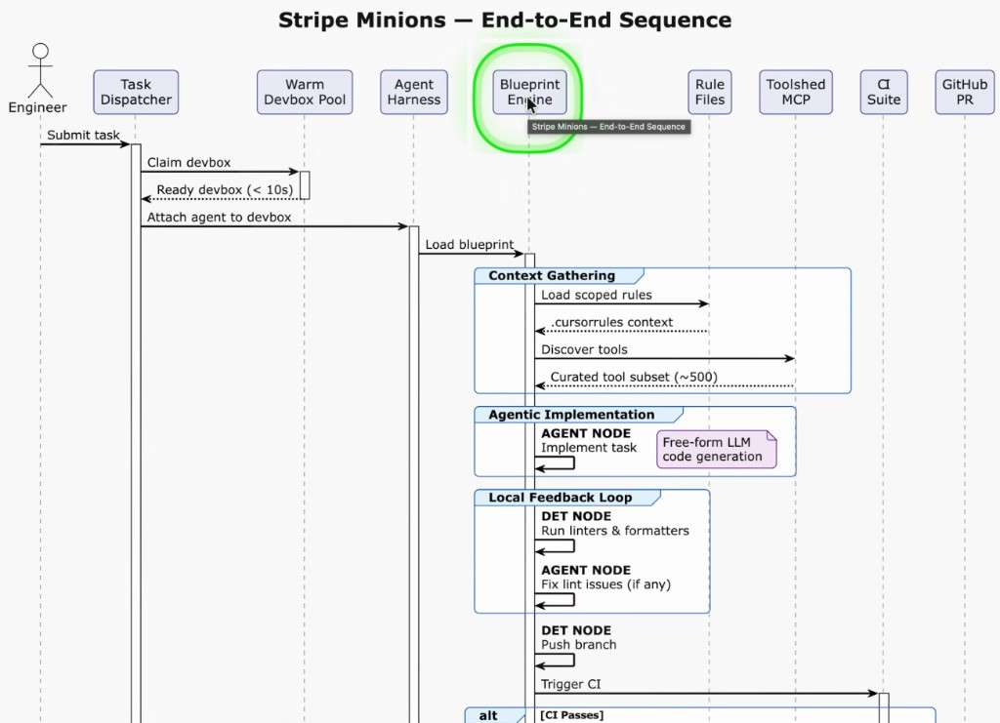

## I Studied Stripe's AI Agents... Vibe Coding Is Already Dead

**Channel:** IndyDevDan  
**Date:** March 2, 2026  
**URL:** https://www.youtube.com/watch?v=V5A1IU8VVp4  
**Length:** 40:31

**Creator description:** Stripe engineers are shipping 1,300 pull requests per week with zero human-written code. Their custom end-to-end coding agents called Minions start from a Slack message and end in a production-ready PR. This video breaks down Stripe's entire agentic layer — from API entry points and warm devbox pools to the blueprint engine that combines deterministic code with agent flexibility.

### Chapters

| Time | Section |
| --- | --- |
| 00:00 | Intro |
| 02:53 | Six Components Overview |
| 04:38 | Why Stripe Built Minions |
| 08:46 | Using Minions |
| 12:19 | Agent Harness |
| 15:30 | Devboxes |
| 19:52 | In-Loop vs Out-Loop |
| 23:13 | Blueprint Engine |
| 27:00 | Context Engineering & Rule Files |
| 29:00 | Toolshed MCP |
| 31:54 | CI & Iteration |
| 37:18 | Key Takeaways |
| 39:10 | Closing |

### Resources

- https://stripe.dev/blog/minions-stripes-one-shot-end-to-end-coding-agents
- https://stripe.dev/blog/minions-stripes-one-shot-end-to-end-coding-agents-part-2
- https://stripe.com/newsroom/news/stripe-2025-update
- https://github.com/block/goose
- https://youtu.be/f8cfH5XX-XU (PI Coding Agent video)
- https://pi.dev/

### Diagram

End-to-end sequence from the video — engineer submits a task through the blueprint engine to a GitHub PR:

## Transcript

### 00:00 — Intro

Are you vibe coding or are you agentic engineering? The difference is massive. Keep that question in mind as you look at one of the best engineering teams on the planet to determine if they're vibe coding or agentic engineering.

Stripe engineers are shipping 1,300 pull requests every single week. There is zero human-written code. And they're doing it right. Imagine what will happen to their numbers — 1.9 trillion in total volume, up 34%, which is the equivalent of 1.6% of global GDP. Stripe's doing $1 billion this year, and they power many of the best companies that you and I use. You yourself might be running on Stripe as well.

What happens when Stripe multiplies all this with agents — and not just agents, but their custom end-to-end solution they're calling Minions? Fully unattended coding agents that start from a Slack message and end in a production-ready PR. This is Stripe's one-shot end-to-end coding agent.

To me, the minions aren't even the most interesting part. The interesting stat is that their agents operate a codebase with millions of lines of code, an uncommon stack with homegrown libraries unique to Stripe and therefore unknown to LLMs. On top of that, the stakes are extremely high — the code moves over $1 trillion per year of payment volume, with real-world dependencies, regulatory and compliance obligations their code must honor.

Do you think Stripe can afford to vibe code?

I've written millions of lines of code with agents and without agents, building with agents since GPT-3.5 Turbo. Allow me to clarify: agentic engineering is knowing what will happen in your system so well you don't need to look. Vibe coding is not knowing and not looking. It's very clear Stripe engineers are agentic engineering.

In this video we'll break down Stripe's agentic layer so you can take the best pieces and add them to your agentic systems. Vibe coding is the lowest hanging fruit. When you agentic-engineer systems — from the prompt to your skills, to your custom agents, to your agent harness, all the way up through your tech stack — you capitalize on the greatest opportunity for engineers to ever exist.

### 02:53 — Six Components Overview

Let's look at their agentic system at a high level so we can analyze the key pieces. If these components interest you, definitely stick around. We're going to break down Stripe's key components, and as we do this, you'll see what you have and what you're missing.

The first thing is the API layer — a way to communicate to their agents, and as you'll see, they have many ways to do this. Then they have a warm devbox pool: an agent sandbox, a space to place their agent. They then have the agent harness — Stripe built their own, forked from a tool we'll cover shortly. And then they have the blueprint engine, the marriage of the old world and the new world, code and agents. This single piece has given Stripe a massive edge.

Then we have the rules file — how did they manage the context problem? Agents cannot read their 100-million-line codebase. We'll talk about the meta layer of their Toolshed: hundreds of tools and tens of services their agents need to operate with. Then of course, they have a way to validate all their agents' work — a critical validation layer giving agents feedback and ensuring they're not breaking existing features that help generate and maintain that movement of one trillion dollars.

These are serious stakes with real-world consequences — not a greenfield rapid prototype application. And then of course, you need a place to review your agents' work: GitHub PRs. Nothing new there, but these are the critical pieces. We're going to walk through them piece by piece and understand how Stripe put them together to build their agentic layer.

### 04:38 — Why Stripe Built Minions

Let's start with their minions. What is Stripe's take on agentic coding?

Agentic coding has gone from new and exciting to table stakes. Unattended coding agents have gone from possibility to reality. If you are not agentic coding, the gap between you and the agentic coding team within a week, within a month, is going to be astronomical — exponential. This is the last moment to hop on the train.

Stripe minions are Stripe's homegrown coding agents — fully unattended, built to one-shot tasks. Thousands of pull requests merged each week contain no human-written code. You have to stop coding to get the real scale, the real power out of these agents. You work on the agents, not the application. That's a weird mindset shift you need to make if you're going to be building with agents.

Developers can still plan and collaborate with traditional agentic coding tools — Claude and Cursor. But in a world where one of the most constrained resources is developer attention, unattended agents allow for parallelization of tasks. The most important resource for any software company is your developer's time, your developer's attention. When you maximize the leverage your developers get, you can do crazy things like this — engineers spinning up multiple minions in parallel, solving multiple problems at the same time in different conditions.

Why did they build it themselves? Isn't Claude Code good enough?

"Vibe coding a prototype from scratch is fundamentally different from contributing to Stripe's codebase." Stripe's codebase encompasses hundreds of millions of lines across a few large repositories, written in Ruby — an uncommon stack — with homegrown libraries LLMs don't have baked in. Stakes are high: over $1 trillion per year in payment volume, with real-world dependencies and compliance obligations.

LLM agents are really great at building from scratch when there are no constraints. However, iterating on any codebase of scale, complexity, and maturity is inherently much harder. Engineers build sophisticated mental models to make changes inside their large repo. Specialization is how you win — when you're building a great product, it is literally a specialized solution to a specialized problem. So why would you stop at your tooling? Your tooling and your code must also be specialized.

Stripe built minions to solve their specific problem and operate their large codebase better than anyone. Specialization is your advantage. You can customize your prompt, your skills, your custom agents, and specialize your agent harness. The more you're building specific solutions to specific problems, the bigger your edge — and the more you distance yourself from the out-of-the-box experiences that all of agentic coding is driving everyone toward.

### 08:46 — Using Minions

What is it like to use a minion?

There are several entry points for minions, designed to integrate as ergonomically as possible where Stripe engineers are. They use a CLI, a web interface, and Slack — three points of contact for kicking off their API. They have a separate application which kicks off their pool of agents, but multiple ways to interface with that primary service.

Here's a clear example: an engineer using `@devbox` and writing their prompt to the agent. They have a custom UI to interface with their custom agent — on the left, a log of tools and the thought process their agents go through; on the right, all modified files so they can see very quickly what's going on. In the top right, actions like create pull request.

You need to be able to observe what's going on. Once a task has been completed, a minion creates a branch, pushes it to CI, and prepares a pull request following Stripe's PR template, then requests review from another Stripe engineer. They can also iterate. This is a classic end-of-process setup when you're agentic coding: you show up at the beginning and the end, during planning and during review, ideally not once in the middle. That creates an out-loop agentic coding system — you write the prompt and you do the review.

How do minions actually work? A minion starts in an isolated developer environment — a devbox — the same type of machine Stripe engineers write on. If you want your agent to do what you can, you must give it the tools and the environment that you have. Stripe reused their developer setup for their agents.

Devboxes are pre-warmed, spun up in 10 seconds — full AWS EC2 instances with Stripe code and services preloaded, isolated so minions can run without human permission checks. This gives parallelization without the overhead of git worktrees, which falls apart at certain scales. After some time, git worktrees just fall apart — you're going to need your own dedicated device.

### 12:19 — Agent Harness

The core agent loop runs on a fork of Block's coding agent Goose, one of the first widely used coding agents, which they forked early on. They customized the orchestration flow in an opinionated way to interleave agent loops and deterministic code — git, linters, and most importantly, testing. This lets your agents operate with feedback and gives you the best of both worlds: the deterministic world and the non-deterministic reasoning creativity world.

They run a mix of creativity of the agent with assurances that they'll always complete Stripe-specific steps like linters. Stripe agentic engineering: determinism with agents.

Connected to MCP, they use Cursor and Claude Code under some conditions. They operate agent rule files — all agent rules are conditionally applied based on subdirectories. They have Toolshed, a meta tool to help select one or more of their 400 MCP tools.

Minions are built with the goal of one-shotting, but if they don't, the key is to give them feedback. They seek to shift feedback left — you want issues to happen earlier rather than later, on the engineer's device, on the agent's device, as early in the process as possible. If local testing doesn't catch anything, they have over 3 million tests that run upon push, selectively choosing from that battery.

One critique: due to cost constraints, they only let minions run at most two rounds of CI. At this scale you have to limit for cost efficiency — we'll talk about that later.

### 15:30 — Devboxes

Part two of the blog: devboxes, hot and ready.

For maximum effectiveness, minion agents require a cloud developer environment that's parallelizable, predictable, and isolated — clearly an agent sandbox giving them a place to operate at scale with full autonomy. If something goes wrong, the agent can't cause as much damage as on your device or a device connected to production. Containerization and git worktrees are great but have hard limits — it's hard to really scale without giving each agent their own device.

Stripe's devbox is a full EC2 instance containing source code and services under development. Many engineers use one devbox per task — half a dozen running at a time. They're allowing engineers to scale impact through parallelization, and every agent has its own sandbox.

They want it to feel effortless to spin up new devboxes — ready in 10 seconds, hot and ready. The raw pieces of engineering should feel effortless. You want to be building systems that allow you to move at the agentic speed — the speed of agents, not humans.

Stripe built out devboxes for human engineers long before LLM coding agents. Parallelism, predictability, and isolation were very good properties for engineers as well as agents.

They built this on their own — they forked Goose and customized it to work within Stripe's LLM infrastructure: custom prompts, custom skills, custom agents, customized agent harness. Customizing your agentic harness gives you a massive edge.

They focus on the needs of minions rather than human-supervised tools — a use case well filled by third-party tools such as Cursor and Claude Code, which are made readily available to their engineers. They're not limiting or forcing engineers to use any specific tooling.

### 19:52 — In-Loop vs Out-Loop

What they are doing is building two types of agentic coding tools: in-loop and out-loop. This is a critical idea to get right if you want to do more with your agentic engineering.

When you are in-loop agentic coding, your butt's in the seat at your desk, prompting back and forth. This is great for highly specialized work, for building the system that builds the system — but bad for everything else. I recommend engineers spend more than 50% of their time building the system of agents that build your application. That's in-loop: full control, you see everything, very manual, but very slow and expensive — you're using human engineer time.

Out-loop agentic coding is what Stripe's minions offer. An out-loop system that operates at scale in parallel in the devbox, in dedicated agent sandboxes. Instead of one engineer with one terminal or three terminals, you can have one engineer with six agent sandboxes operating and solving problems at scale in parallel — and six is just the beginning. You should be handing off more work over time to your out-loop system. That saves you from the expensive time you'll spend. Your agentic systems you can clone, dupe, parallelize as far as your system allows — that's the lever agentic engineering unlocks.

Off-the-shelf local coding agents are optimized for workflows where the engineer is sitting looking over its shoulder — babysitting the agent. Minions are fully unattended, so their agent harness can't use human-facing features. They built the minion to be fully autonomous — humans cannot interject. That's not the point; they operate on their own.

Claude Code, Cursor CLI, pi.dev — you can programmatically inject these into your out-loop systems, deploy an agent outside the loop on a cron job or via API request. That is where all agentic engineers must move to get massive leverage.

### 23:13 — Blueprint Engine

Right next to devboxes, the next most important thing is their blueprint engine.

They talk about workflows versus agents, loops, series of steps. Minions are orchestrated with a primitive called blueprints — workflows defined in code that direct a minion run. Blueprints combine the determinism of workflows with agents' flexibility in dealing with the unknown. This is code plus your agent — the highest leverage point of agentic coding.

In essence, a blueprint is a collection of agent skills interwoven with deterministic code so particular subtasks can be handled most appropriately. Some things — a linter, a git commit, running tests, creating templates — are pieces an agent would perform worse at. Adding an agent to specific steps makes the whole system worse, more brittle, and more expensive. For these steps, why throw an agent at that problem?

The real advantage: agents plus code beats agents alone, and agents plus code beats code alone.

You have agent nodes — implement the task, fix CI failures — and deterministic nodes — run configured linters, push changes — that don't invoke an LLM at all, they just run code. Agent running, then code running, then agent running, then code running. Not everything needs an agent and not everything needs code.

Blueprint machinery makes context engineering with sub-agents easy because they're operating at a specific step — you might constrain tools, constrain the system prompt, or modify the conversation required by the subtask. Chunk big problems into small pieces, give each to code or to agents. This is the highest leverage point — the combination of code and agents inside a repeatable format for success. They can deploy meta-agentics — effectively an agent that builds their blueprint and validates it.

### 27:00 — Context Engineering & Rule Files

They use rule files much like `CLAUDE.md` or `AGENTS.md`. Due to the size of the repository, they can't have unconditional global rules — they need scoped rules. They're using a standardized rule format much like Cursor's: `.cursor/rules/` with markdown files and front matter (MDC files), where you specify the glob pattern to activate context, or apply only when specific files are being accessed.

This gives control over the context loaded as the agent traverses different directories. The key line: "We almost exclusively give minions context from files that are scoped to specific subdirectories or patterns automatically attached as the agent traverses the filesystem."

They've combined Cursor rules with a format from Claude Code — building customized agentic solutions that best solve the problems they're facing, combining the best from the industry. The question is: what's the best way for you, and how do you get the most leverage out of what's available?

### 29:00 — Toolshed MCP

Tools are the essential element — context, model, prompt, tools. Tools created agentic coding; agents can now take actions as we can. How does Stripe handle their 500 MCP tools? Won't this immediately cause a token explosion? Absolutely — so they built Toolshed.

A centralized internal MCP server called Toolshed makes it easy for Stripe engineers to author new tools, automatically discoverable in their agentic systems. All agentic systems can use Toolshed — meta-agentics. You build prompts that create prompts, agents that build agents, skills that build skills, tools that allow you to select tools. The Toolshed is a tool that unlocks tools for their agents.

This is not new — OG engineers know meta-programming, passing functions into functions. What's important is thinking about when you need to build the thing that builds the thing. Stripe uses Toolshed to connect to nearly 500 MCP tools for internal and external services. A centralized location to load specific tools — completely net new to me, really cool.

### 31:54 — CI & Iteration

All this stuff is so new, moving so quickly. It's not about what you can do anymore — it's about what you can teach your agents to do for you. Teach your agents how to build like you would so you can scale them.

Stripe has multiple CI entry points, EC2 agent sandboxes mirroring developer environments, their own custom agent harness, a customizable blueprint engine combining code and agents, rules files for context engineering, Toolshed for selecting from 500 tools, CI for self-validation, and GitHub PRs for review.

I'd rank Stripe's agentic layer 8 out of 10 — very powerful. Two notes of feedback:

First, why only two rounds of CI feedback? Speed, completeness, cost — fair constraints, but I think it's a mistake. Has anyone ever said "solve this problem, you have two attempts"? It often takes tens and hundreds of tries. Limiting minions to two shots may cost more developer time and reduce learnings from running more rounds.

Second, the language of "end-to-end." They have a prompt step and a review step — that's two steps. True end-to-end is prompt to production, P2P — zero-touch engineering, no review, no human in the loop. What would it take to run a prompt and trust your agentic system can deliver to production without human oversight? The value is in the journey of the question. I predict in 2026 we'll see a blog post from an engineer at serious scale breaking down prompt-to-production with zero-touch engineering.

Building a powerful agentic layer comes down to owning all the pieces bottom to top. There's a point where you need a specific customized solution — your agents should reflect that, just like your application is a detailed edge-case-covering solution. Specialization goes all the way up the chain, all the way into the agent harness, all the way to your stack of technology.

### 37:18 — Key Takeaways

Let's up-level and talk about the systems that have agents inside of them, that contain agents and code and modern engineering technology that puts it all together to generate real value for you, your team, your company, and ultimately your users and customers.

You want to be thinking about the agentic layer as a whole — not just your coding tool, not just the models. Ease up on the obsession with models and who's winning. Focus on solving problems by building agentic layers with the key pieces Stripe has outlined. Every agentic layer, every product is going to run into the problems that each one of these nodes is a solution to. These are pieces to the puzzle of building at scale with agents.

No one has all the answers right now — it's about collecting the right context for solving the problem of agentic engineering and pushing what you can do further before the mainstream catches up. Everything in engineering represents an asymmetry of information, then technology, then results. Stay focused on valuable signal in the industry, not hype, not slop.

### 39:10 — Closing

If you made it to the end, check out Tactical Agentic Coding — my take on how to scale far beyond AI coding and vibe coding with advanced agentic engineering so powerful your codebase runs itself. A lot of the ideas in this blog, in the architecture of how Stripe built their agentic coding tool, are detailed there.

I'll link the Minions post — definitely give it a look. Stripe is hiring. Big shout out to the Stripe team and Alistair Gray for writing this up — really great engineering in the age of agents. No matter what, stay focused and keep building.
